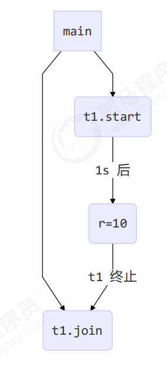
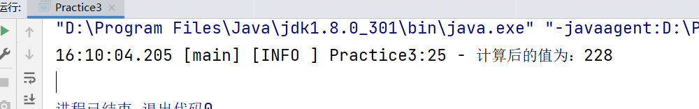
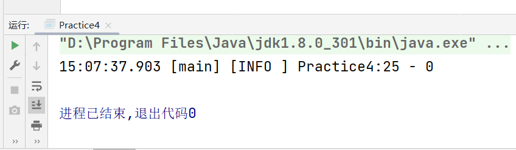
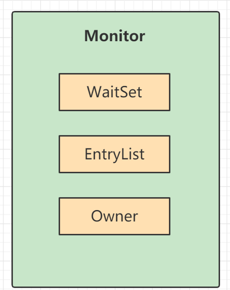
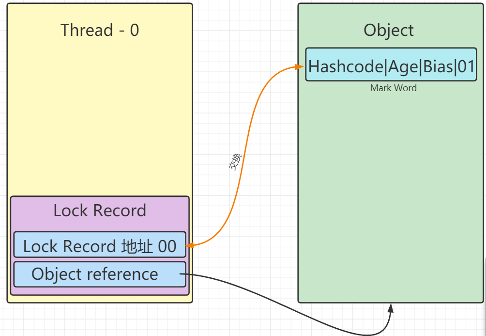
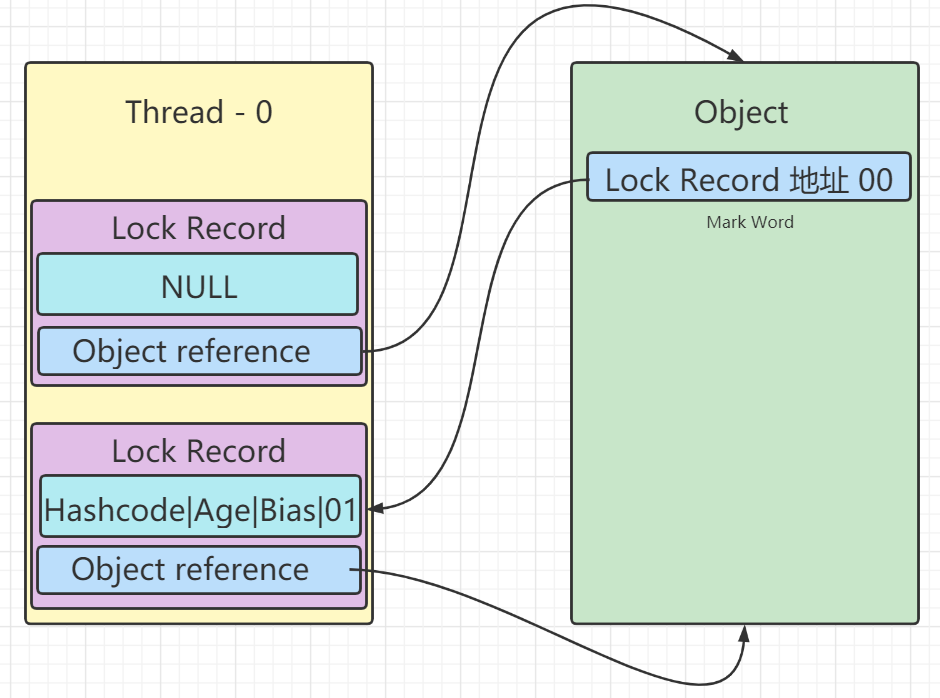
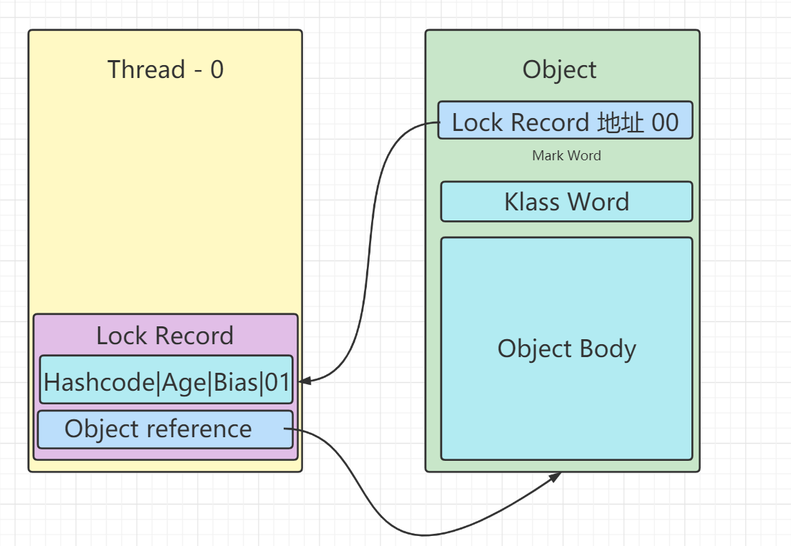
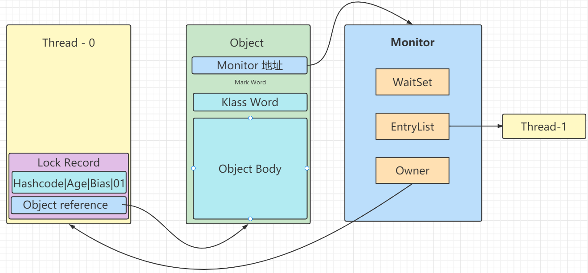
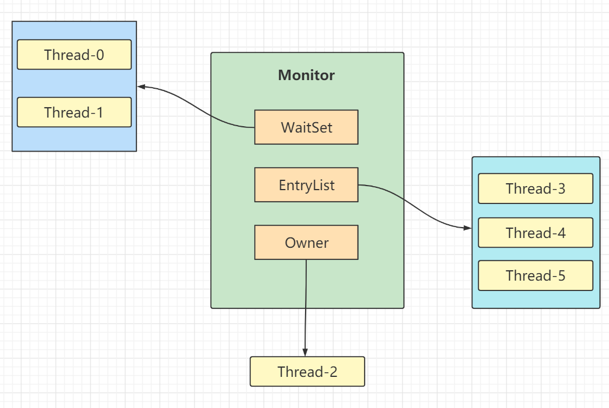

## 进程与线程

### 进程

程序由指令和数据组成，但这些指令要运行，数据要读写，就必须将指令加载至CPU，数据加载至内存。在指令运行过程中还需要用到磁盘、网络等设备。进程就是用来加载指令、管理内存、管理IO的。当一个程序被运行，从磁盘加载这个程序的代码至内存，这时就开启了一个进程。
进程就可以视为程序的一个实例。大部分程序可以同时运行多个实例进程（例如记事本、画图、浏览器等)，也有的程序只能启动一个实例进程（例如网易云音乐、360安全卫士等)。

### 线程

一个进程之内可以分为一到多个线程。
一个线程就是一个指令流，将指令流中的一条条指令以一定的顺序交给CPU执行
 Java中，线程作为最小调度单位，进程作为资源分配的最小单位。在windows 中进程是不活动的，只是作为线程的容器。

### 进程和线程对比

+ 进程基本上相互独立的，而线程存在于进程内，是进程的一个子集

+ 进程拥有共享的资源，如内存空间等，供其内部的线程共享

+ 进程通信比线程复杂
  
  + 进程间通信较为复杂，同一台计算机的进程通信称为IPC (Inter-process communication)；不同计算机之间的进程通信，需要通过网络，并遵守共同的协议，例如HTTP。
  
  + 线程通信相对简单，因为它们共享进程内的内存，一个例子是多个线程可以访问同一个共享变量

+ 线程更轻量，线程上下文切换成本一般上要比进程上下文切换低

### 并发

单核cpu下，线程实际还是串行执行的。操作系统中有一个组件叫做任务调度器，将cpu的时间片( windows下时间片最小约为115亳秒)分给不同的线程使用，只是由于cpu在线程间（时间片很短）的切换非常快，人类感觉是同时运行的。总结为一句话就是:微观串行，宏双并行，将多线程同时使用CPU的行为叫做并发，Concurrent。

### 并行

多核CPU可以同时调度运行线程，这时是并行，parallel。

### 同步与异步

从方法调用的角度来讲，如果

+ 需要等待结果返回，才能继续运行就是同步

+ 不需要等待结果返回，就能继续运行就是异步

注意:同步在多线程中还有另外一层意思，是让多个线程步调一致

Java中采用多线程可以异步调用方法

## 线程基础知识

### 线程的创建

#### 方式一（使用Thread类）

```java
//创建线程 构造方法可以指定线程的名字
Thread thread = new Thread("FirstThread"){
    @Override
    public void run() {
        logger.info("Hello");
    }
};
//启动线程
thread.start();
```

#### 方式二（使用Runnable接口）

该方法的好处是可以将线程的创建和线程的执行分开

```java
//创建线程
Runnable runnable = new Runnable() {
    @Override
    public void run() {
        logger.info("你好");
    }
};
//运行线程,构建Thread对象
Thread thread = new Thread(runnable);
thread.setName("RunnableThread");
thread.start();
```

Runnable接口还可以使用lambda表达式创建对象。

方式一和方式二两者在本质上近乎相同，如果使用Runnable对象构建方法，Thread对象会在run方法中调用Runnable的run方法。使用Runnable接口可以巧妙的避开Thread的继承体系，更加灵活。

#### 方式三（使用FutureTask）

该方式可以获得执行的返回值，FutureTask需要配合Callable使用

```java
//创建FutureTask
FutureTask<Integer> futureTask = new FutureTask<>(new Callable<Integer>() {
    @Override
    public Integer call() throws Exception {
        logger.info("My return is 100");
        return 100;
    }
});
//创建Thread
Thread taskThread = new Thread(futureTask);
taskThread.setName("futureTask");
//启动线程
taskThread.start();
//获得线程的返回值，在执行get方法前，如果线程没有结束，程序会在此阻塞
logger.info("FutureTask return value is " + futureTask.get());
```

### 线程上下文切换（Thread Context Switch)

因为以下一些原因导致cpu不再执行当前的线程，转而执行另一个线程的代码就是线程上下文的切换。

+ 线程的cpu时间片用完

+ 垃圾回收

+ 有更高优先级的线程需要运行

+ 线程自己调用了sleep、yield、wait、join、park、synchronized、lock等方法

当Context Switch发生时，需要由操作系统保存当前线程的状态（状态包括程序计数器、虚拟机栈中每个栈帧的信息等），并恢复另一个线程的状态，JVM中对应的概念就是程序计数器(Program Counter Register)，它的作用是记住下一条JVM指令的执行地址。Context Switch频繁发生会影响性能，所以线程并不是越多越好。

### Start和Run方法

直接调用 run 是在主线程中直接执行了run方法，没有启动新的线程

使用 start 是启动新的线程，通过新的线程执行run 中的代码

### Sleep方法

1. 调用 sleep 会让当前线程从 Running 进入 Timed Waiting 状态（阻塞）

2. 其它线程可以使用 interrupt 方法打断正在睡眠的线程，这时 sleep 方法会抛出 InterruptedException

3. 睡眠结束后的线程未必会立刻得到执行

4. 建议用 TimeUnit 的 sleep 代替 Thread 的 sleep 来获得更好的可读性

### Yield方法

1.调用yield 会让当前线程从Running进入Runnable 就绪状态，然后调度执行其它线程

2.具体的实现依赖于操作系统的任务调度器

Yield方法会让线程进入就绪状态（Runnable），就绪状态依旧可能会被CPU分配时间片。Sleep方法会使线程进入阻塞状态，CPU不会讲时间片分配给阻塞状态的线程。

### 线程优先级

优先级是Thread类的setPriority方法来进行设置。线程优先级会提示(hint)调度器优先调度该线程，但它仅仅是一个提示，**调度器可以忽略它**。如果cpu比较忙，那么优先级高的线程会获得更多的时间片，但cpu闲时，优先级几乎没作用。

### Join方法

Jion方法可以等待某个线程结束。调用Join后，调用Join的线程会阻塞，直到被调用Join的线程结束，调用Join的线程才会恢复运行

#### 同步

以调用方角度来讲，如果

+ 需要等待结果返回，才能继续运行就是同步

+ 不需要等待结果返回，就能继续运行就是异步



join方法还有一个有参数的重载方法，该方法可以设置等待的最长毫秒数。

### Interrupt方法

> 可以使用一下两种方法测试线程的打断标记
> 
> **public boolean isInterrupted()**
> 
> 测试这个线程是否被中断。 线程的*中断状态*不受此方法的影响。
> 
> 忽略线程中断，因为线程在中断时不存在将被该方法返回false所反映。
> 
> 结果
> 
> `true`如果这个线程已被中断; `false`否则。
> 
> **public static boolean interrupted()**
> 
> 测试当前线程是否中断。 该方法可以清除线程的*中断状态* 。 换句话说，如果这个方法被连续调用两次，那么第二个调用将返回false（除非当前线程再次中断，在第一个调用已经清除其中断状态之后，在第二个调用之前已经检查过）。
> 
> 忽略线程中断，因为线程在中断时不存在将被该方法返回false所反映。
> 
> 结果
> 
> `true`如果当前线程已被中断; `false`否则。

#### 打断被sleep、wait、join阻塞的线程

打断这些线程会使得被打断的线程抛出InterruptedException异常，并不会导致打断标记为真

#### 打断正常运行的线程

会使得打断标记为真

#### 打断park线程

> LockSupport.park()
> 
> ---
> 
> **public static void park()**
> 
> 禁止当前线程进行线程调度，除非许可证可用。
> 
> 如果许可证可用，则它被消耗，并且该呼叫立即返回; 否则当前线程对于线程调度目的将被禁用，并且处于休眠状态，直至发生三件事情之一：
> 
> - 一些其他线程调用当前线程作为目标的[`unpark`](../../../../java/util/concurrent/locks/LockSupport.html#unpark-java.lang.Thread-) ; 要么
> - 其他一些线程当前线程为[interrupts](../../../../java/lang/Thread.html#interrupt--) ; 要么
> - 电话虚假（也就是说，没有理由）返回。
> 
> 这种方法*不*报告是哪个线程导致该方法返回。 来电者应重新检查导致线程首先停放的条件。 呼叫者还可以确定线程在返回时的中断状态。
> 
> ---
> 
> 注意：只有在中断标记为假的时候，park方法才能阻断线程的运行

使用interrupt方法打断park方法阻断的线程时，会使得线程恢复运行。

#### JDK不推荐使用的过时方法

| 方法名       | 功能说明       |
| --------- | ---------- |
| stop()    | 停止线程运行     |
| suspend() | 挂起（暂停）线程运行 |
| resume()  | 恢复线程运行     |

### 守护线程

默认情况下，Java 进程需要等待所有线程都运行结束，才会结束。有一种特殊的线程叫做守护线程，只要其它非守护线程运行结束了，即使守护线程的代码没有执行完，也会强制结束。

在线程start()前调用其的setDaemon(true)方法即可将该线程设置成为守护线程。

### 线程状态

#### 操作系统层面

.png)

操作系统层面的阻塞是指调用了阻塞的API，如BIO的文件读取API，在Java中”可运行“、”运行“、”阻塞“同属”可运行状态“，Java中的阻塞是指当先线程试图获得一个由其他线程占有的锁时，它会被阻塞。

.png)

## 共享模型之管程

### Synchronized

#### Synchronized代码块

synchronized，来解决临界区的竞态条件发生，即俗称的【对象锁】，它采用互斥的方式让同一时刻至多只有一个线程能持有【对象锁】，其它线程再想获取这个【对象锁】时就会阻塞住。这样就能保证拥有锁的线程可以安全的执行临界区内的代码，不用担心线程上下文切换。

> 注意
> 
> 虽然 java 中互斥和同步都可以采用 synchronized 关键字来完成，但它们还是有区别的：
> 
> 互斥是保证临界区的竞态条件发生，同一时刻只能有一个线程执行临界区代码
> 
> 同步是由于线程执行的先后、顺序不同、需要一个线程等待其它线程运行到某个点

代码示例：

不加Synchronize的多个线程对变量的读写

```java
package com.example.parctice;

import org.apache.logging.log4j.LogManager;
import org.apache.logging.log4j.Logger;

public class Practice3 {
    private static final Logger logger = LogManager.getLogger(Practice3.class);
    private static final Object lock = new Object();
    private static int value = 0;
    public static void main(String[] args) throws InterruptedException {
        Thread threadAdd = new Thread(() -> {
            for (int i = 0; i < 1000; i++) {
                value++;
            }
        });
        Thread threadSub = new Thread(() -> {
            for (int i = 0; i < 1000; i++) {
                value--;
            }
        });
        threadAdd.start();
        threadSub.start();
        threadAdd.join();
        threadSub.join();
        logger.info("计算后的值为：{}", value);
    }
}
```

结果不能确定为多少：



加了Synchronized的代码：

```java
package com.example.parctice;

import org.apache.logging.log4j.LogManager;
import org.apache.logging.log4j.Logger;

public class Practice3 {
    private static final Logger logger = LogManager.getLogger(Practice3.class);
    private static final Object lock = new Object();
    private static int value = 0;
    public static void main(String[] args) throws InterruptedException {
        Thread threadAdd = new Thread(() -> {
            synchronized (lock){
                for (int i = 0; i < 1000; i++) {
                    value++;
                }
            }
        });
        Thread threadSub = new Thread(() -> {
            synchronized (lock){
                for (int i = 0; i < 1000; i++) {
                    value--;
                }
            }
        });
        threadAdd.start();
        threadSub.start();
        threadAdd.join();
        threadSub.join();
        logger.info("计算后的值为：{}", value);
    }
}
```

其运行结果总是0；

Synchronized还可以对当先对象加锁，实例如下

```java
public class Practice4 {
    public static final Logger logger = LogManager.getLogger(Practice4.class);
    public static void main(String[] args) throws InterruptedException {
        Room room = new Room();
        Thread t1 = new Thread(() -> {
            for (int i = 0; i < 500; i++) {
                room.add();
            }
        });
        Thread t2 = new Thread(() -> {
            for (int i = 0; i < 500; i++) {
                room.sub();
            }
        });
        t1.start();
        t2.start();
        t1.join();
        t2.join();
        logger.info(room.getCount());
    }
}
class Room{
    private int count = 0;
    public void add(){
        synchronized (this){
            count++;
        }
    }
    public void sub(){
        synchronized (this){
            count--;
        }
    }
    public int getCount(){
        return count;
    }
}
```



#### Synchronized方法

```java
class Test{
    //普通方法上的synchronized
    public synchronized void test() {

    }
}
//↑等价于↓
class Test{
    public void test() {
        synchronized(this) {

        }
    }
}
```

```java
class Test{
    //静态方法上的synchronized
    public synchronized static void test() {

    }
}
//↑等价于↓
class Test{
    public static void test() {
        synchronized(Test.class) {

        }
    }
}
```

### 变量的线程安全分析

#### 成员变量和静态变量的线程安全问题

如果它们没有被共享，则是线程安全的

如果它门被共享了，共享过程中如果只有读操作，则线程安全，如果同时具有读写操作，则需要考虑线程安全问题

#### 局部变量的线程安全问题

局部变量自身是线程安全的

局部变量如果是引用类型，其引用的对象未必是线程安全的

+ 如果该对象没有逃离当前方法的作用范围，则它是线程安全的

+ 如果该对象逃离了当前方法的作用范围，则需要考虑线程安全问题

### 线程安全的类

String

基本类型的包装类

StringBuffffer

Random

Vector

Hashtable

java.util.concurrent 包下的类

这些类的方法是线程安全的，但是方法的组合不一定是原子的

```java
Hashtable table = new Hashtable();
if( table.get("key") == null) {
 table.put("key", value);
}
```

这段操作就是不安全的

### Synchronized底层原理

#### Java对象头

对象在内存中由两部分构成对象头+数据（成员变量）

普通对象

```java
|--------------------------------------------------------------| 
|                Object Header (64 bits)                       |
|------------------------------------|-------------------------|
|           Mark Word (32 bits)      |   Klass Word (32 bits)  |
|------------------------------------|-------------------------|
```

数组对象

```java
|---------------------------------------------------------------------------------|
|                                Object Header (96 bits)                          |
|--------------------------------|-----------------------|------------------------|
|       Mark Word(32bits)        |   Klass Word(32bits)  |  array length(32bits)  |
|--------------------------------|-----------------------|------------------------|
```

Klass Word指向对象所从属的类对象，从而确定当前对象的类型

MarkWord结构

```java
|--------------------------------------------------|-----|--------------------|
|                   Mark Word (32 bits)            |标记位|        State       |
|--------------------------------------------------------|--------------------|
|    hashcode:25   |    age:4  |   biased_lock:0   | 01  |      Normal        |
|--------------------------------------------------------|--------------------|
|    thread:23  | epoch:2 |  age:4 | biased_lock:1 | 01  |      Biased        |
|--------------------------------------------------------|--------------------|
|      ptr_to_lock_record:30                       | 00  | Lightweight Locked |
|--------------------------------------------------------|--------------------|
|      ptr_to_heavyweight_monitor:30               | 10  | Heavyweight Locked |
|--------------------------------------------------------|--------------------|
|                                                  | 11  |    Marked for GC   |
|--------------------------------------------------|-----|--------------------|
```

#### Monitor

Monitor可以被翻译成监视器或者管程。

> 在 Java 虚拟机(HotSpot)中，Monitor 是基于 C++实现的，由[ObjectMonitoropen in new window](https://github.com/openjdk-mirror/jdk7u-hotspot/blob/50bdefc3afe944ca74c3093e7448d6b889cd20d1/src/share/vm/runtime/objectMonitor.cpp)实现的。每个对象中都内置了一个 `ObjectMonitor`对象。
> 
> 另外，`wait/notify`等方法也依赖于`monitor`对象，这就是为什么只有在同步的块或者方法中才能调用`wait/notify`等方法，否则会抛出`java.lang.IllegalMonitorStateException`的异常的原因。

每个Java对象都可以关联一个Monitor对象，如果使用synchronized给对象上锁之后，该对象的对象头中的Mark Word中就被设置指向Monitor的对象的指针。

Monitor中有很多成员变量



1.刚开始Monitor 中 Owner为null

2.当Thread-2执行synchronized(obj)就会将Monitor 的所有者Owner置为Thread-2，Monitor中只能有一个Owner

3.在Thread-2上锁的过程中，如果Thread-3，Thread-4，Thread-5也来执行synchronized(obj)，就会进入EntryList这些线程的状态为BLOCKED

4.Thread-2执行完同步代码块的内容，然后唤醒EntryList 中等待的线程来竞争锁，竞争的时是非公平的

5.图中WaitSet 中存储的是之前获得过锁，但条件不满足进入WAITING 状态的线程

#### 轻量级锁

轻量级锁的使用场景:如果一个对象虽然有多线程访问，但多线程访问的时间是错开的（也就是没有竞争)，那么可以使用轻量级锁来优化。轻量级锁对使用者是透明的，即语法仍然是synchronized

假设有两个方法同步块，利用同一个对象加锁。

```java
static final object obj = new object();
public static void method1(){
    synchronized(obj) {
        //同步块A
        method2( );
    }
}
public static void method2(){
    synchronized(obj){
        //同步块B
    }
}
```

##### 轻量级锁的加锁流程

每个线程的栈中都会包含一个锁记录的结构。当一个对象需要被加锁时，首先会让所记录 Lock Record对象中的Object reference指向被锁定的对象。而后通过cas将被锁定对象的Mark Word存入Lock Record对象。



如果cas失败，会是以下两种情况导致的：

+ 已经有其他线程持有了该对象的轻量级锁（即标志位为00）

+ 如果是本线程自己执行了synchronized锁重入，则会再在当前线程的栈中添加一条Lock Record作为重入计数
  
  + ```java
    //代码示例
    static final object obj = new object();
    public static void method1(){
        synchronized(obj) {
            //同步块A
            method2( );
        }
    }
    public static void method2(){
        synchronized(obj){
            //同步块B
        }
    }
    ```
  
  + 在进行锁重入时，被加锁对象不会再与新的Lock Record对象交换Mark Word，被加锁对象的Mark Word中的Lock Record指针依旧指向第一个Lock Record对象，但是新的Lock Record对象中的Object Reference依旧会指向被加锁对象。
    
    
  
  + 当要退出重入锁时，发现如果有取值为NULL的锁记录，即为重入锁，直接清楚掉即可

退出轻量级锁时，如果发现锁记录不为NULL，即当前的锁不是重入锁，这时使用cas将Mark Word的值恢复给对象头，即可退出。

#### 锁膨胀（重量级锁）

如果在尝试加轻量级锁的过程中，cas无法成功，有一种情况是，有其他线程已经为此对象加入上了轻量级锁（发生了竞争），这时需要进行锁膨胀，将轻量级锁变为重量级锁。

1.首先Thread-0持有了Object的轻量级锁



2.此时如果Thread-1也想对Object进行加锁，首先会尝试对Object加轻量锁。但是由于Thread-0已经持有了Object的轻量锁，所以会加锁失败。此时进入锁膨胀阶段。

+ 首先为Object对象申请Monitor对象，让Object的Mark Word指向Monitor对象的地址，Monitor对象中的Owner 指向Thread-0。

+ 然后Thread-1自己进入Monitor对象的Entry List。线程状态变为BLOCKED。



3.当Thread-0同步代码块退出时，Thread-0会释放轻量级锁，这是会尝试使用cas将Mark Word的值恢复给Object，但由于Object的Mark Word已经指向Monitor，cas会失败，这是 则进入重量级锁的解锁流程。即按照Monitor地址，找到Monitor对象，将Owner设置为NULL，唤醒Entry List中BLOCKED的线程。

#### 自旋优化

重量级锁竞争时，为了避免线程进入阻塞状态，可以使用自旋优化。当前线程如果想获得某个对象的重量级锁，且这个重量级锁当前被其他线程持有，就可以进行自旋。如果自旋结束后，该重量级锁已经被释放，那么当前线程就可以直接持有该锁，从而避免进入了阻塞状态，从而避免了线程上下文的切换。

自旋优化只有在多核CPU的情况下才有意义。

在Java 6之后自旋锁是自适应的，比如对象刚刚的一次自旋操作成功过，那么认为这次自旋成功的可能性会高，就多自旋几次;反之，就少自旋甚至不自旋，总之，比较智能。
自旋会占用CPU时间，单核CPU自旋就是浪费，多核CPU自旋才能发挥优势。

Java 7之后不能控制是否开启自旋功能

#### 偏向锁

轻量级锁在没有竞争时(就自己这个线程)，每次重入仍然需要执行CAS操作。Java 6 中引入了偏向锁来做进一步优化:只有第一次使用CAS将线程ID设置到对象的 Mark Word头，之后发现这个线程ID是自己的就表示没有竞争，不用重新CAS。以后只要不发生竞争，这个对象就归该线程所有。

+ 如果开启了偏向锁（默认开启)，那么对象创建后，markword值为0x05即最后3位为101这时它的thread、epoch、age都为0 

+ 偏向锁是默认是延迟的，不会在程序启动时立即生效;如果想避免延迟，可以加VM参数-XX:BiasedLockingStartupDelay=0来禁用延迟
- 如果没有开启偏向锁，那么对象创建后，markword值为0x01，即最后3位为001，这时它的hashcode、age都为0，第一次用到hashcode时才会赋值

使用`-XX:-UseBiasedLocking`可以禁用偏向锁（`-XX:+UseBiasedLocking`为启用偏向锁）

锁的升级：

```java
                            如果有其他
       如果偏向锁可用         线程使用锁            发生竞争
无锁----------------->偏向锁------------>轻量级锁------------->重量级锁
```

##### 偏向锁的撤销

下列情况会导致偏向锁的不可用。即使设定了`-XX:+UseBiasedLocking`参数，对象依旧不能使用偏向锁。

###### 调用对象的HashCode

偏向锁的对象MarkWord中存储的是线程id，如果调用hashCode会导致偏向锁被撤销。

+ 轻量级锁会在锁记录中记录hashCode

+ 重量级锁会在Monitor中记录hashCode

+ 偏向锁无法存储hashCode

在调用hashCode后使用偏向锁，记得去掉-xX:-UseBiasedLocking

###### 其他线程使用对象

当其他线程使用了偏向锁对象，会将偏向锁升级为轻量级锁。

###### 调用wait/notify

wait和notify只用重量级锁（monitor）才能提供，所以调用会导致偏向锁的撤销。

##### 批量重偏向

如果对象虽然被多个线程访问，但没有竞争，这时偏向了线程T1的对象仍有机会重新偏向T2，重偏向会重置对象的Thread ID

当一个类所产生的对象撤销偏向锁次数超过一个阈值（默认是20次）后且没有竞争状态时，jvm会在给这些对象加锁时重新加上偏向锁，偏向至加锁线程，而不会升级为轻量级锁。

##### 批量撤销

当撤销偏向锁阈值超过40次后，jvm会这样觉得，自己确实偏向错了，根本就不该偏向。于是整个类的所有对象都会变为不可偏向的，新建的对象也是不可偏向的

##### 锁消除

对于不可能发生共享和竞争的同步代码段，JVM中的JIT会将其优化掉，即去除锁

`-XX:-EliminateLocks`关闭锁消除

### Wait/Notify

#### Wait/Notify工作原理



+ Owner发现当前的条件不满足当前的工作，可以调用wait()方法，即可令当前线程进入WaitSet，状态变为WAITING。

+ 进入WaitSet中WAITING的线程，会在Owner调用notify()或者notifyAll()时被唤醒，被唤醒后不意味着会立刻获得锁，而是会进入EntryList进行竞争。

+ 在EntryList中的线程会在Owner线程释放锁时被唤醒，通过竞争获得锁。

#### API介绍

wait()：让进入监视器（Monitor）的线程进入到WaitSet等待

notify()：在WaitSet中等待的线程中挑选一个唤醒

notifyAll()：将在WaitSet中等待的全部线程都唤醒

这些都是线程之间协作的手段，都属于Object对象的方法，必须获得此对象的锁，才能调用这几个方法

#### Wait和Sleep

1.sleep是Thread的方法，wait是Object的方法

2.sleep不需要强制和synchronized配合使用，但是wait需要和synchronized一起使用

3.sleep不会释放锁，而wait在等待的时候会释放锁

### Park/Unpark

它们都是LockSupport类中的方法

```java
//暂停当前线程
LockSupport.park();


//恢复某个线程的运行
LockSupport.unpark(暂停线程对象);
```

**与 Object 的 wait & notify 相比**

+ wait，notify 和 notifyAll 必须配合 Object Monitor 一起使用，而 park，unpark 不必

+ park & unpark 是以线程为单位来【阻塞】和【唤醒】线程，而 notify 只能随机唤醒一个等待线程，notifyAll是唤醒所有等待线程，就不那么【精确】

+ park & unpark 可以先 unpark，而 wait & notify 不能先 notify

### 死锁

1、互相持有
就是A进程持有B进程需要继续工作的资源，反过来，B进程同时也持有A进程需要继续工作的资源。
2、循环等待
这个好理解，就是两个进程间互相需要对方的资源，而且不断等待着对方资源。
3、不可剥夺
和优先级一样，不能够一个进程强行从另外一进程把需要的资源强制夺取过来
4、资源互斥
这个意思是说资源必须是独的，一个进程拥有，另外一个进程就不能拥有。

### 活锁

*活锁*指的是任务或者执行者没有被阻塞，由于某些条件没有满足，导致一直重复尝试—失败—尝试—失败的过程。处于*活锁*的实体是在不断的改变状态，*活锁*有可能自行解开。

### 定位检测死锁

可以使用JConsole或者JStack来检测

### ReentrantLock

基本语法

```java
static ReentrantLock reentrantLock = new ReentrantLock();

    public static void main(String[] args) {
        //加锁
        reentrantLock.lock();
        try{
            //临界区代码
        }finally {
            //解锁
            reentrantLock.unlock();
        }
    }
```

#### 可重入

可重入是指如果一个线程首次获得了这把锁，那么它没有释放锁的期间，它有权利再次获得这把锁。

synchronized和reentrantLock都是可重入锁

#### 可打断

在等待锁的过程中，可以被其他线程给打断。可打断的获得锁的API与普通获得锁的API不同。

```java
public class Practice6 {
    private final static Logger logger = LogManager.getLogger(Practice6.class);
    private final static ReentrantLock reentrantLock = new ReentrantLock();
    private static boolean isRunning = false;
    public static void main(String[] args) {
        //主线程先获得锁
        logger.info("主线程获得锁");
        reentrantLock.lock();
        //另一个线程在去可打断的获得锁
        Thread thread = new Thread(() -> {
            logger.info("启动运行");
            isRunning = true;
            try {
                //可打断的获得锁
                logger.info("尝试获得锁");
                reentrantLock.lockInterruptibly();//可打断的获得一个锁
                logger.info("成功获得锁！");
            } catch (InterruptedException e) {
                throw new RuntimeException("在等待锁的过程中被打断");
            }finally {
                try {
                    reentrantLock.unlock();
                }catch (IllegalMonitorStateException e){
                    logger.info("当前线程未获得锁");
                }
            }
        });
        //启动另一个线程
        thread.start();
        while (!isRunning){
            break;
        }
        //主线程去打断尝试获得锁的线程
        logger.info("尝试打断{}", thread.getName());
        thread.interrupt();
    }
}
```

```java
//运行结果如下
10:18:21.896 [main] [INFO ] Practice6:14 - 主线程获得锁
10:18:21.899 [Thread-1] [INFO ] Practice6:18 - 启动运行
10:18:21.899 [Thread-1] [INFO ] Practice6:22 - 尝试获得锁
10:18:21.900 [main] [INFO ] Practice6:41 - 尝试打断Thread-1
10:18:21.901 [Thread-1] [INFO ] Practice6:31 - 当前线程未获得锁
Exception in thread "Thread-1" java.lang.RuntimeException: 在等待锁的过程中被打断
    at com.example.parctice.Practice6.lambda$main$0(Practice6.java:26)
    at java.lang.Thread.run(Thread.java:748)
```

#### 锁超时

如果在一定的时间内没有获得到锁，就不会尝试再获得锁。使用锁超时的API时也可以打断。

```java
public class Practice7 {
    private static final Logger logger = LogManager.getLogger(Practice7.class);
    private static final ReentrantLock reentrantLock = new ReentrantLock();

    public static void main(String[] args) throws InterruptedException {
        reentrantLock.lock();
        Thread thread = new Thread(() -> {
            //尝试获得锁，如果没有获得到也不等待
            if(reentrantLock.tryLock()){
                logger.info("获得到锁");
                reentrantLock.unlock();
            }else {
                logger.info("没有获得到锁");
            }
        });
        thread.start();
        thread.join();
        reentrantLock.unlock();
    }
}
```

```java
public class Practice7 {
    private static final Logger logger = LogManager.getLogger(Practice7.class);
    private static final ReentrantLock reentrantLock = new ReentrantLock();

    public static void main(String[] args) throws InterruptedException {
        reentrantLock.lock();
        Thread thread = new Thread(() -> {
            try {
                //尝试获得锁，如果没有获得到等待5s，如果依旧没有获得到就放弃
                if(reentrantLock.tryLock(5, TimeUnit.SECONDS)){
                    logger.info("获得到锁");
                    reentrantLock.unlock();
                }else {
                    logger.info("没有获得到锁");
                }
            } catch (InterruptedException e) {
                throw new RuntimeException(e);
            }
        });
        thread.start();
        thread.join();
        reentrantLock.unlock();
    }
}
```

#### 公平锁

公平锁就是指，在等待锁的线程中，线程获得锁时公平的（先到先得），可以解决线程饥饿问题（线程长时间得不到运行）。

synchronized是非公平锁，ReentranteLock默认是非公平锁，但可以设置成公平锁。

```java
//获得公平锁
ReentrantLock reentrantLock = new ReentrantLock(true)
```

公平锁一般没有必要，且会降低并发度。

#### 条件变量

ReentrantLock支持多个条件变量。

```java
private static final ReentrantLock reentrantLock = new ReentrantLock();
    public static void main(String[] args) {
        //创建一个新的条件变量
        Condition condition = reentrantLock.newCondition();
        reentrantLock.lock();
        //在条件变量处等待
        condition.await();
        //唤醒一个在条件变量处等待的线程
        condition.signal();
        //唤醒在条件变量处等待的全部线程
        condition.signalAll();
        reentrantLock.unlock();
    }
```

使用流程：

1.使用await前需要获得锁

2.await后会释放锁，进入conditionObject等待

3.await的线程被唤醒（或打断、超时）后需要重新争得锁

4.竞争到锁后，从await后继续执行

## 共享模型之内存

### Java内存模型

Java内存模型，JMM即 Java Memory Model，它定义了主存（所有线程都共享的数据）和工作内存（线程私有的数据）的抽象概念，底层对应着CPU寄存器、缓存、硬件内存、CPU指令优化等。JMM主要是为了屏蔽系统和硬件的差异。

JMM体现在以下几个方面

+ 原子性-保证指令不会受到线程上下文切换的影响

+ 可见性-保证指令不会受cpu缓存的影响

+ 有序性-保证指令不会受cpu指令并行优化的影响

#### 可见性

在 JDK1.2 之前，Java 的内存模型实现总是从**主存**（即共享内存）读取变量，是不需要进行特别的注意的。而在当前的 Java 内存模型下，线程可以把变量保存**工作内存（本地内存）** 比如机器的寄存器中，而不是直接在主存中进行读写。这就可能造成一个线程在主存中修改了一个变量的值，而另外一个线程还继续使用它在工作内存中的变量值的拷贝，造成**数据的不一致**。

把变量声明为 **`volatile`** ，这就指示 JVM，这个变量是共享且不稳定的，每次使用它都到主存中进行读取。

> Synchronized即可以保证原子性，也可以保证可见性

#### 有序性

JVM会在不影响正确性的前提下，调整语句的执行顺序。

```java
int a = 5;
int b = 9;
```

例如上述代码执行时的真正顺序有可能是先声明赋值b，也有可能是先声明赋值a。

这种现象是指令重排，是JIT在运行时的一些优化。

使用volatile关键字可以禁用指令重拍，保证有序性。

### Volatile

Volatile关键字可以保证可见性和有序性，但是不能保证指令交错

#### Volatile原理

volatile的底层实现原理是内存屏障，Memory Barrier

+ 对volatile变量的写指令后会加入写屏障

+ 对volatile变量的读指令前会加入读屏障

##### 保证可见性

写屏障（sfence）保证在该屏障之前，对共享变量的改动都会同步到主存当中。

读屏障（lfence）保证在该屏障之后，对共享变量的读取都会加载主存中最新的数据。

##### 保证有序性

写屏障会确保指令重拍时，不会将写屏障前的代码排在写屏障之后。

读屏障会确保指令重拍时，不会讲读屏障后的代码排在读屏障之前。

### CAS

CAS是方法compareAndSet或方法CompareAndSwap的简称，是在CPU层面上实现的原子操作。

作用是在满足条件时，修改值。compareAndSet(previous, next);当目标值和previous相同时，则修改值为next。若目标值和previous不相同，则修改失败。

> 其底层使用的是lock cmpxchg指令(X86架构)，单核和多核CPU下都能保证比较和交换值的原子性。

## 线程池

### 为什么要使用线程池

- **降低资源消耗**。通过重复利用已创建的线程降低线程创建和销毁造成的消耗。
- **提高响应速度**。当任务到达时，任务可以不需要等到线程创建就能立即执行。
- **提高线程的可管理性**。线程是稀缺资源，如果无限制的创建，不仅会消耗系统资源，还会降低系统的稳定性，使用线程池可以进行统一的分配，调优和监控。

### 线程池中的线程

线程池中的线程分为两种，核心线程和救急线程。当阻塞队列已满且还有新任务到来的情况下，线程池会创建救急线程。救急线程在结束后，会等待一个生存时间，生存时间结束后如果没有任务，救急线程会被结束。核心线程数＋救急线程数=最大线程数。

### 创建线程池的方式

#### ThreadPoolExecutor

可以通过`ThreadPoolExecutor`构造函数来创建线程池，其构造函数如下。

```java
public ThreadPoolExecutor(int corePoolSize,
                              int maximumPoolSize,
                              long keepAliveTime,
                              TimeUnit unit,
                              BlockingQueue<Runnable> workQueue,
                              ThreadFactory threadFactory,
                              RejectedExecutionHandler handler) 
```

构造函数参数的解释如下，其中加粗的三项为核心参数：

- **corePoolSize 核心线程数目 (最多保留的线程数)**

- **maximumPoolSize 最大线程数目**

- keepAliveTime 生存时间 - 针对救急线程

- unit 时间单位 - 针对救急线程

- **workQueue 阻塞队列**
  
  核心线程用完了，再加入的任务，首先就会加入到阻塞队列中

- threadFactory 线程工厂
  
  可以为线程创建时起个好名字

- handler 拒绝策略

#### Executors

还可以通过 `Executor` 框架的工具类 `Executors` 来创建线程池。

> 另外，《阿里巴巴 Java 开发手册》中强制线程池不允许使用 `Executors` 去创建，而是通过 `ThreadPoolExecutor` 构造函数的方式，这样的处理方式让写的同学更加明确线程池的运行规则，规避资源耗尽的风险。

通过`Executors`可以创建多种类型的`ThreadPoolExecutor`:

- **`FixedThreadPool`**：该方法返回一个固定线程数量的线程池。该线程池中的线程数量始终不变。当有一个新的任务提交时，线程池中若有空闲线程，则立即执行。若没有，则新的任务会被暂存在一个任务队列中，待有线程空闲时，便处理在任务队列中的任务。
- **`SingleThreadExecutor`：** 该方法返回一个只有一个线程的线程池。若多余一个任务被提交到该线程池，任务会被保存在一个任务队列中，待线程空闲，按先入先出的顺序执行队列中的任务。
- **`CachedThreadPool`：** 该方法返回一个可根据实际情况调整线程数量的线程池。线程池的线程数量不确定，但若有空闲线程可以复用，则会优先使用可复用的线程。若所有线程均在工作，又有新的任务提交，则会创建新的线程处理任务。所有线程在当前任务执行完毕后，将返回线程池进行复用。
- **`ScheduledThreadPool`**：该返回一个用来在给定的延迟后运行任务或者定期执行任务的线程池。

### 线程池状态

ThreadPoolExecutor 使用 int 的高 3 位来表示线程池状态，低 29 位表示线程数量

| 状态名        | 高 3位 | 接收新任务 | 处理阻塞队列任务 | 说明                     |
| ---------- | ---- | ----- | -------- | ---------------------- |
| RUNNING    | 111  | Y     | Y        |                        |
| SHUTDOWN   | 000  | N     | Y        | 不会接收新任务，但会处理阻塞队列剩余任务   |
| STOP       | 001  | N     | N        | 会中断正在执行的任务，并抛弃阻塞队列任务   |
| TIDYING    | 010  |       |          | 任务全执行完毕，活动线程为 0 即将进入终结 |
| TERMINATED | 011  |       |          | 终结状态                   |

从数字上比较，TERMINATED > TIDYING > STOP > SHUTDOWN > RUNNING

这些信息存储在一个原子变量 ctl 中，目的是将线程池状态与线程个数合二为一，这样就可以用一次 cas 原子操作进行赋值

### 线程池的饱和策略

如果当前同时运行的线程数量达到最大线程数量并且队列也已经被放满了任务时，`ThreadPoolTaskExecutor` 定义一些策略:

- **`ThreadPoolExecutor.AbortPolicy`：** 抛出 `RejectedExecutionException`来拒绝新任务的处理。
- **`ThreadPoolExecutor.CallerRunsPolicy`：** 调用执行自己的线程运行任务，也就是直接在调用`execute`方法的线程中运行(`run`)被拒绝的任务，如果执行程序已关闭，则会丢弃该任务。因此这种策略会降低对于新任务提交速度，影响程序的整体性能。如果您的应用程序可以承受此延迟并且你要求任何一个任务请求都要被执行的话，你可以选择这个策略。
- **`ThreadPoolExecutor.DiscardPolicy`：** 不处理新任务，直接丢弃掉。
- **`ThreadPoolExecutor.DiscardOldestPolicy`：** 此策略将丢弃最早的未处理的任务请求。

### 线程池的任务处理流程


1. 如果当前运行的线程数小于核心线程数，那么就会新建一个线程来执行任务。
2. 如果当前运行的线程数等于或大于核心线程数，但是小于最大线程数，那么就把该任务放入到任务队列里等待执行。
3. 如果向任务队列投放任务失败（任务队列已经满了），但是当前运行的线程数是小于最大线程数的，就新建一个线程来执行任务。
4. 如果当前运行的线程数已经等同于最大线程数了，新建线程将会使当前运行的线程超出最大线程数，那么当前任务会被拒绝，饱和策略会调用`RejectedExecutionHandler.rejectedExecution()`方法。

## ThreadLocal

ThreadLocal叫做线程变量、线程本地变量，意思是ThreadLocal中填充的变量属于当前线程，该变量对其他线程而言是隔离的，也就是说该变量是当前线程独有的变量。ThreadLocal为变量在每个线程中都创建了一个副本，那么每个线程可以访问自己内部的副本变量。对于ThreadLocal变量，每个线程都使用 `get()` 和 `set()` 方法来获取或修改其中存放的值，从而避免了线程安全问题。

### 原理

每个线程都拥有一个自己的**ThreadLocalMap**。ThreadLockMap中会存储**以ThreadLock对象为Key，ThreadLocal中的变量为Value的键值对**。

### ThreadLocal的内存泄露风险

`ThreadLocalMap` 中使用的 key 为 `ThreadLocal` 的弱引用，而 value 是强引用。所以，如果 `ThreadLocal` 没有被外部强引用的情况下，在垃圾回收的时候，key 会被清理掉，而 value 不会被清理掉。

> 弱引用也是用来描述那些非必须对象，但是它的强度比软引用更弱一些，被弱引用关联的对象只能生存到下一次垃圾收集发生为止。当垃圾收集器开始工作，无论当前内存是否足够，都会回收掉只被弱引用关联的对象。

这样一来，`ThreadLocalMap` 中就会出现 key 为 null 的 Entry。假如我们不做任何措施的话，value 永远无法被 GC 回收，这个时候就可能会产生内存泄露。`ThreadLocalMap` 实现中已经考虑了这种情况，在调用 `set()`、`get()`、`remove()` 方法的时候，会清理掉 key 为 null 的记录。使用完 `ThreadLocal`方法后最好手动调用`remove()`方法

### 使用场景

存储系统当前的登录用户信息是ThreadLocal的一个很常见的用户场景，使用示例如下。

```java
/**
 * 当前登录用户身份存储
 */
public class UserInfoHolder {
    /**
     * 用户信息存储ThreadLocal
     */
    private static final ThreadLocal<UserInfoBO> userInfoStorage = ThreadLocal.withInitial(() -> null);

    /**
     * 设置用户身份信息
     */
    public static void set(UserInfoBO userInfoBO){
        userInfoStorage.set(userInfoBO);
    }

    /**
     * 获得当前登录的用户身份信息
     */
    public static UserInfoBO get(){
        return userInfoStorage.get();
    }

    /**
     * 移除线程中的登录用户信息
     */
    public static void remove(){
        userInfoStorage.remove();
    }
}
```

## AQS

AbstractQueuedSynchronizer 是阻塞式锁和相关的同步器工具的框架。

特点：

用state属性来表示资源的状态，分为独占模式和共享模式。子类需要定义如何维护这个状态，控制如何获取和释放锁。

提供基于FIFO的等待队列，类似于Monitor的EntryList

条件变量实现等待、唤醒机制，支持多个条件变量
