# JVM概览

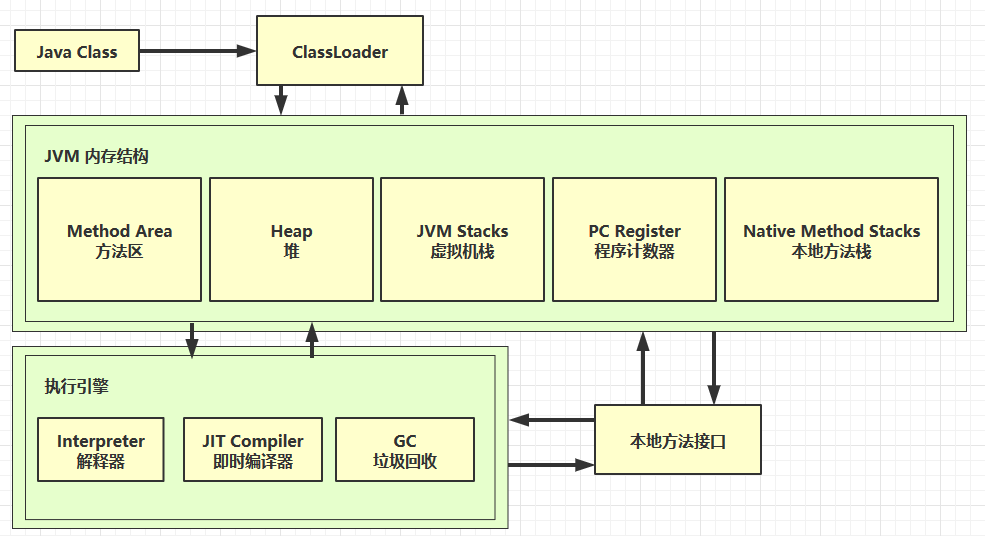

## 常见JVM

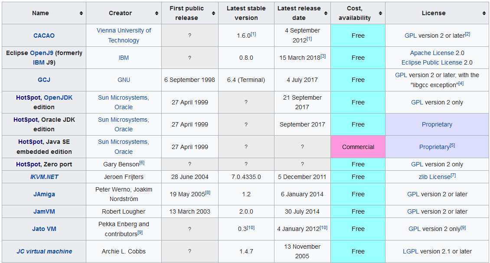

**武林盟主:HotSpot VM**
相信所有Java程序员都听说过HotSpot 虚拟机，它是Sun/OracleJDK和OpenJDK中的默认Java虚拟机，也是目前使用范围最广的Java 虚拟机。但不一定所有人都知道的是，这个在今天看起来“血统纯正”的虚拟机在最初并非由Sun公司所开发，而是由一家名为“Longview Technologies”的小公司设计。HotSpot既继承了Sun之前两款商用虚拟机（Classic VM和Exact VM）的优点,也有许多自己新的技术优势，如它名称中的HotSpot 指的就是它的热点代码探测技术。

## JVM文档

Java语言和虚拟机规范：[Java SE Specifications (oracle.com)](https://docs.oracle.com/javase/specs/index.html)

JVM参数简要概括：[Java虚拟机详解（五）------JVM参数 - 知乎 (zhihu.com)](https://zhuanlan.zhihu.com/p/151402603)

查看对应版本的JVM参数方式：

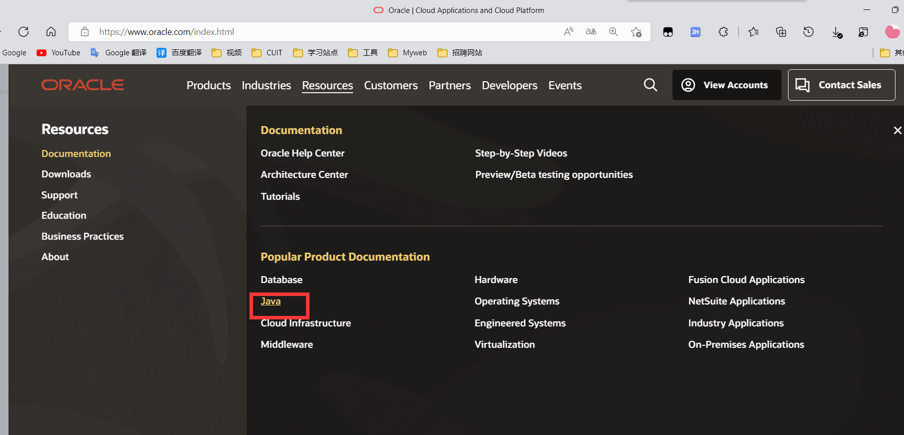


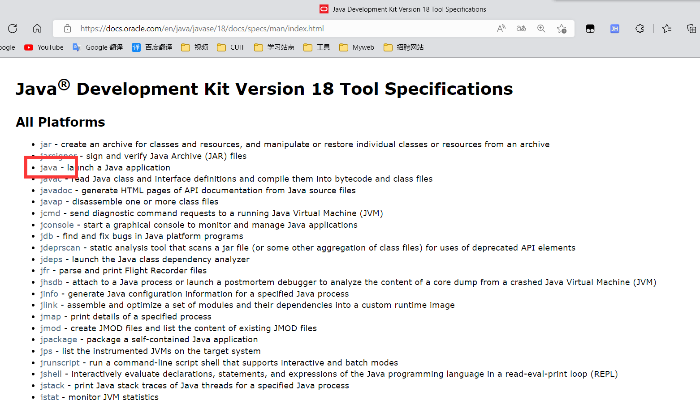

# 内存结构

## 程序计数器（PC Register）

Program Counter Register 程序计数器（寄存器）的作用是记住下一条jvm指令的执行地址。

特点：

+ 是线程私有的

+ 不会存在内存溢出（是JVM中唯一不存在内存移除的结构）

## 虚拟机栈（JVM Stacks）

### 相关定义

Java Virtual Machine Stacks （Java 虚拟机栈）

+ 每个线程运行时所需要的内存，称为虚拟机栈

+ 每个栈由多个栈帧（Frame）组成，每个栈帧对应着每次方法调用时所占用的内存

+ 每个线程只能有一个活动栈帧，对应着当前正在执行的那个方法

栈的基本图示：

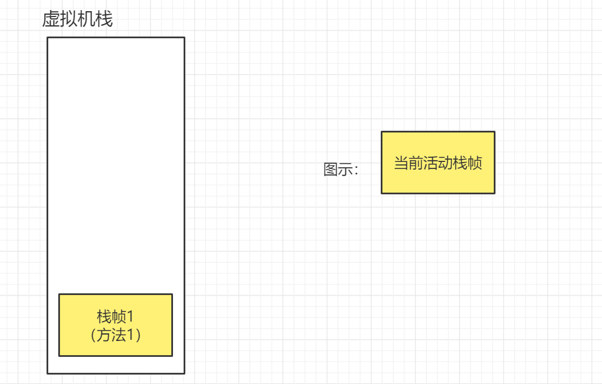

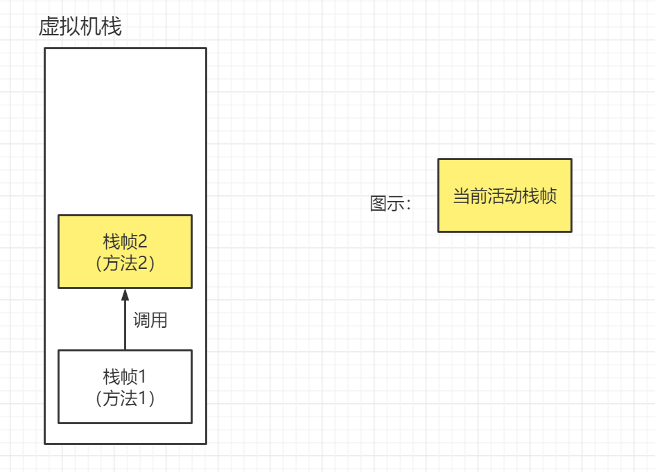

**常见问题**

**垃圾回收是否涉及栈内存？**

不涉及。栈内存中只有栈帧内存，当一个方法的调用结束，其所使用的栈帧内存自然被释放。

**栈内存分配越大越好吗？**

栈内存在运行时可以通过虚拟机参数设定来指定。一般情况下是1024kb。

> Linux/x64(64-bit):1024 KBmacOS(64-bit): 1024 KB
> Oracle Solaris/x64(64-bit): 1024 KB
> Windows: The default value depends on virtual memory

栈内存分配的越大，机器中能同时运行的线程数就会减少（因为物理内存是恒定的），所以把栈内存设定的越大只能增加递归调用的次数，并不一定能提升程序的运行效率。

**方法内的局部变量是否线程安全？**

因为一个线程对应一个栈，一个方法对应一个栈中的栈帧，所以如果方法内局部变量没有逃离方法的作用访问，它是线程安全的；

如果是局部变量引用了对象，并逃离方法的作用范围，需要考虑线程安全。

### 栈内存溢出

有以下两种情况会导致栈内存溢出：

栈帧过多导致栈内存溢出（通常是由于递归调用退出不正确造成的）

栈帧过大导致栈内存溢出

### 线程诊断

#### CPU占用过高

**可能导致CPU占用过高的原因及其应对方案**

云服务器被黑客攻击，植入了挖矿程序：端口不能够被外网访问

程序死循环：控制循环次数

服务器被[DDOS攻击](https://so.csdn.net/so/search?q=DDOS%E6%94%BB%E5%87%BB&spm=1001.2101.3001.7020)：限流、ip黑名单、图形验证码

**排查CPU占用过高，定位错误的业务代码**

+ 定位出现问题的进程：可以采用TOP命令

+ 根据异常的进程找出有错误的线程：ps H -eo pid,tid,%cpu | grep 进程id （用ps命令进一步定位是哪个线程引起的cpu占用过高）

+ 使用JDK提供的jstack工具分析错误：jstack 进程id

    jstack命令可以生成JVM当前时刻的线程快照。线程快照是当前JVM内每一条线程正在执行的方法堆栈的集合，生成线程快照的主要目的是**定位线程出现长时间停顿的原因**，如**线程间死锁、死循环、请求外部资源导致的长时间等待**等。

    注意：使用ps命令查看得出的线程id是十进制的，jstack查看得出的线程id是十六进制的

#### 程序迟迟得不到运行结果

可能发生程序死锁，可以采用jstack工具进行分析

## 本地方法栈（Native Method Stacks）

当JVM调用本地方法时，给本地方法提供的内存空间就是本地方法栈

> 本地方法（Native Method）指不是由Java编写的方法。通过本地方法（可能由C语言或其他语言编写）可以与直接与操作系统底层API打交道。

## 堆（Heap）

上述的程序计数器、虚拟机栈、本地方法栈都是线程私有的，而堆和方法区是线程共享的。

通过`new`关键字创建的对象都会使用堆内存

特点：

+ 堆是线程共享的，堆中的对象需要考虑线程安全问题

+ 有垃圾回收机制

### 堆内存溢出

当堆中的对象不能被垃圾回收时，过多的对象会导致堆内存溢出错误。

控制JVM堆内存的参数是`-Xmx`(注意大小写)，例如将堆内存空间设置成8m：`-Xmx8m`

### 堆内存诊断

#### jps 工具

查看当前系统中有哪些 java 进程

#### jmap 工具

查看堆内存占用情况，使用方法：`jmap - heap 进程id`，一般使用jps工具获得到对应进程的ID后就可以使用jmap工具进行分析

#### jconsole 工具

图形界面的，多功能的监测工具，可以连续监测

#### jvisualvm工具

采用可视化的方式展现虚拟机内容

#### 在执行多次垃圾回收后，内存占用依旧很高？

可以使用jconsole来对指定的进程执行垃圾回收，如果再垃圾回收后，堆内存的占用依旧很大，可以按照如下方式进行排查：

打开jvisualvm工具，查看堆Dump


在堆dump中查找最大对象，而后根据查找结果进行分析

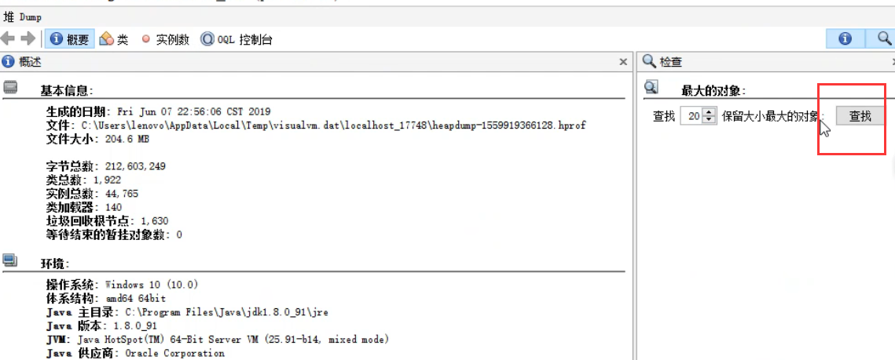

## 方法区（Method Area）

Java虚拟机规范：[The Java® Virtual Machine Specification (oracle.com)](https://docs.oracle.com/javase/specs/jvms/se8/html/index.html)

虚拟机规范中对方法区的定义如下

> The Java Virtual Machine has a *method area* that is shared among all Java Virtual Machine threads. The method area is analogous to the storage area for compiled code of a conventional language or analogous to the "text" segment in an operating system process. It stores per-class structures such as the run-time constant pool, field and method data, and the code for methods and constructors, including the special methods ([§2.9](https://docs.oracle.com/javase/specs/jvms/se8/html/jvms-2.html#jvms-2.9 "2.9. Special Methods")) used in class and instance initialization and interface initialization.
> 
> The method area is created on virtual machine start-up. Although the method area is logically part of the heap, simple implementations may choose not to either garbage collect or compact it. This specification does not mandate the location of the method area or the policies used to manage compiled code. The method area may be of a fixed size or may be expanded as required by the computation and may be contracted if a larger method area becomes unnecessary. The memory for the method area does not need to be contiguous.
> 
> A Java Virtual Machine implementation may provide the programmer or the user control over the initial size of the method area, as well as, in the case of a varying-size method area, control over the maximum and minimum method area size.
> 
> The following exceptional condition is associated with the method area:
> 
> - If memory in the method area cannot be made available to satisfy an allocation request, the Java Virtual Machine throws an `OutOfMemoryError`.

方法区是线程共享的（shared among all Java Virtual Machine threads），它用来存储每个类的结构，比如运行时常量池（run-time constant pool）、成员变量（field）、方法的数据（method data）、方法和构造器的代码（the code for methods and constructors）。方法区在JVM启动的时候被创建，它在逻辑上是是堆（heap）的一部分，但在实际实现时却并不一定是如此。方法区仅仅是一种JVM的规范，规定哪些数据是存储在方法区的，元空间和永久代其实都是方法区的实现，只是实现有所不同，所以说方法区其实只是一种JVM的规范。

OracleJDK的方法区实现，1.8以前是永久代PermGen，1.8之后是元空间Metaspace。

永久代和元空间的作用都是存储Class(类)的元数据，用来存储Class相关信息，包括Class对象的Method，Field等。永久代和元空间的区别本质只有一个，那就是永久代使用的是JVM内存存储，而元空间使用的是本地内存存储。元空间与永久代区别是其内存空间直接使用的是本地内存，而Metaspace（元空间）没有了字符串常量池，而在Jdk7的时候已经被移动到了堆中，MetaSpace存储其他需要存储的东西，包括类文件，在JAVA虚拟机运行时的数据结构，以及Class相关的内容，如Method，Field。道理上都与永久代一样，只是划分上更趋于合理，比如说类及相关的元数据的生命周期与类加载器一致，每个加载器就是我们常说的Classloader，都会分配一个单独的存储空间。可以参考：[JVM之 方法区、永久代（PermGen space）、元空间（Metaspace）三者的区别_猎人在吃肉的博客-CSDN博客_方法区和元空间区别](https://xiaojin21cen.blog.csdn.net/article/details/104267301)

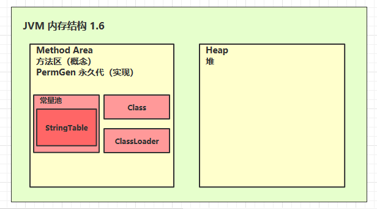


### 方法区内存溢出

当类加载器加载了太多类后，超过了方法区的大小，就会造成方法区内存溢出：OutOfMemoryError

在实际开发中，使用Spring、Mybatis等框架时其底层依赖的动态代理技术会在运行时载入大量的二进制类，这可能会造成方法区的内存溢出，不过当方法区的实现由永久代（1.8以前）升级成元空间（1.8及以后）后，这一问题得到了解决。

### 常量池

Java文件被编译成 class文件，class文件中除了包含类的版本、字段、方法、接口等描述信息外，还有一项就是常量池（Constant Pool），用于存放编译器生成的各种字面量（ Literal ）和 符号引用（Symbolic References）。


### 运行时常量池

运行时常量池：常量池是 *.class 文件中的，当该类被加载，它的常量池信息就会放入运行时常量池，并把里面的符号地址变为真实地址。

Jvm在执行某个类的时候，必须经过加载、连接、初始化，而连接又包括验证、准备、解析三个阶段。而当类加载到内存中后，Jvm就会将 `class常量池` 中的内容存放到 `运行时常量池` 中，由此可知，`运行时常量池` 也是每个类都有一个。

### StringTable（String Pool）

StringTable，串池，字符串常量池（在每个VM中只有一份）。在Java代码中使用如下方式创建的字符串会被放入字符串常量池中。

```java
String test = "This is a String";
```

在上方代码后，如果再次通过双引号创建字符串的方式创建一个内容与`test`相同的对象。则该对象的地址和`test`的地址相同。也就是说JVM虚拟机并不会再创建一个新对象，而是会将其的引用指向字符串常量池中已有的对象的地址。

字符串常量池是JVM专门开辟出的一片用来存储字符串的空间，其采用的是类似HashTable的数据结构，不能扩容 ，但其大小可以通过JVM参数指定。

记住：String Pool 中存的是 **引用值**，而不是具体的实例对象，具体的实例对象是在堆中开辟的一块空间存放的

> **三者对比**
> 
> **常量池**
> 每个class一份，存在于字节码文件中。常量池中有字面量(数量值、字符串值)和符号引用(类符号引用、字段符号引用、方法符号引用)，虚拟机指令根据这张常量表找到要执行的类名、方法名、参数类型、字面量等类型
> 
> **运行时常量池**
> 每个class一份，存在于方法区中(元空间)。当类加载到内存中后，jvm就会将class常量池中的内容存放到运行时常量池中，经过解析（resolve）之后，也就是把符号引用替换为直接引用，解析的过程会去查询全局字符串池，也就是下面的StringTable，以保证运行时常量池所引用的字符串与全局字符串池中所引用的是一致的。
> 
> **字符串常量池**
> 每个JVM中只有一份，存在于方法区中(堆)。全局字符串池里的内容是在类加载完成，经过验证，准备阶段之后在堆中生成字符串对象实例，然后将该字符串对象实例的引用值存到string pool中（string pool中存的是引用值而不是具体的实例对象，具体的实例对象是在堆中开辟的一块空间存放的）。 在HotSpot VM里实现的string pool功能的是一个StringTable类，它是一个哈希表，里面存的是驻留字符串（用双引号括起来的引用而不是驻留字符串实例本身），也就是说在堆中的某些字符串实例被这个StringTable引用之后就等同被赋予了”驻留字符串”的身份。
> ————————————————
> 版权声明：本文为CSDN博主「岛田悠米」的原创文章，遵循CC 4.0 BY-SA版权协议，转载请附上原文出处链接及本声明。
> 原文链接：https://blog.csdn.net/qq_44752641/article/details/119906982

参考文档：[class常量池、字符串常量池和运行时常量池的区别_猎人在吃肉的博客-CSDN博客_字符串池和常量池有什么区别](https://blog.csdn.net/xiaojin21cen/article/details/105300521)

[Java字符串池（String Pool）深度解析 - 风中程序猿 - 博客园 (cnblogs.com)](https://www.cnblogs.com/fangfuhai/p/5500065.html)

#### 关于字符串的拼接

对于如下包含变量的字符串拼接，JVM会调用StringBuilder的append方法

```java
String a = "a";
String b = "b";
String ab = "ab";
String abOfAppend = a + b;
```

上述代码中的`abOfAppend`会被优化为`new StringBuilder().append(a).append(b).toString()`,也就是`abOfAppend`与`ab`指向的地址并不相等。但如果是字符串之间的直接相加，则JavaC会在编译期间直接将其优化成一个字符串。

```java
String ab = "ab"
String aAppendB = "a" + "b";
```

在上述代码中`"a" + "b"`会被JVM直接优化为`"ab"`，所以ab和aAppendB的指向地址是相同的。

#### 关于字符串的创建

##### 通过双引号直接创建

使用双引号直接创建的字符串会被JVM放到字符串常量池中，如果再有相同的字符串出现，虚拟机不会再新建对象，而是直接使用常量池中的对象引用。

例如，如下的程序：

```java
public static void test1(){
     String s1 = "abc";
     String s2 = "abc";
     System.out.println(s1 == s2);
 }
```

运行结果如下：

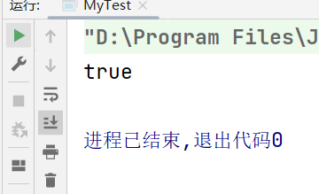

##### 通过构造方法String(String original)创建

通过此构造方法创建的对象，其参数表的中的字符串也会被放置到字符串常量池的中。但是JVM仍会在堆中新创建创建一个对象，不过该对象和字符串常量池的的对象所引用的Value是相同的。

```java
    public static void test2() throws ClassNotFoundException, NoSuchFieldException, IllegalAccessException {
        String s1 = "abc";
        String s2 = new String("abc");
        //获得String类的Class
        Class<?> stringClass = Class.forName("java.lang.String");
        //获得String类的value成员变量
        Field value = stringClass.getDeclaredField("value");
        //忽略对Value的访问权限检查
        value.setAccessible(true);
        //获得S1对象的value值
        Object s1Value = value.get(s1);
        //获得S2对象的Value值
        Object s2Value = value.get(s2);
        System.out.print("S1与S2的地址是否相等:");
        System.out.println(s1 == s2);
        System.out.print("S1与S2对象中Value所指向的地址是否相等:");
        System.out.println(s1Value == s2Value);
    }
```

运行结果如下：

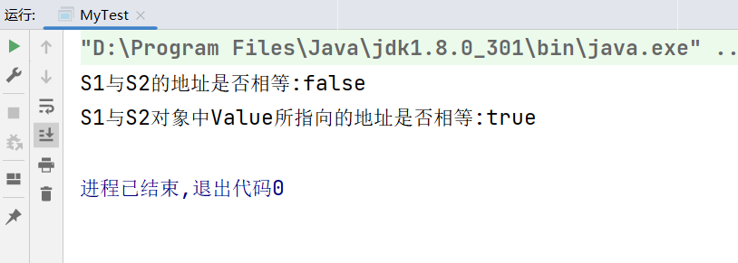

该构造方法的实现如下：

```java
    public String(String original) {
        this.value = original.value;
        this.hash = original.hash;
    }
```

##### 通过其他方式构建

通过其他方式构建的字符串仅会存储在堆中，不会存储在字符串常量池中，其Value也将会与其在字符串常量值中值相同的对象不同。

```java
    public static void test3() throws ClassNotFoundException, NoSuchFieldException, IllegalAccessException {
        String s1 = "abc";
        String s2 = new String(new char[]{'a', 'b', 'c'});
        //获得String类的Class
        Class<?> stringClass = Class.forName("java.lang.String");
        //获得String类的value成员变量
        Field value = stringClass.getDeclaredField("value");
        //忽略对Value的访问权限检查
        value.setAccessible(true);
        //获得S1对象的value值
        Object s1Value = value.get(s1);
        //获得S2对象的Value值
        Object s2Value = value.get(s2);
        System.out.print("S1与S2的值是否相同:");
        System.out.println(s1.equals(s2));
        System.out.print("S1与S2的地址是否相等:");
        System.out.println(s1 == s2);
        System.out.print("S1与S2对象中Value所指向的地址是否相等:");
        System.out.println(s1Value == s2Value);
    }
```

运行结果如下：


##### Intern()方法

intern方法可以将当前的字符串对象尝试放入字符串常量池中，如果字符串常量池中没有与该对象值相等的字符串，则将其放入；如果有，则返回字符串常量池中与该对象相等的字符串。

> Returns a canonical representation for the string object.
> A pool of strings, initially empty, is maintained privately by the class String.
> When the intern method is invoked, if the pool already contains a string equal to this String object as determined by the equals(Object) method, then the string from the pool is returned. Otherwise, this String object is added to the pool and a reference to this String object is returned.
> It follows that for any two strings s and t, s.intern() == t.intern() is true if and only if s.equals(t) is true.
> All literal strings and string-valued constant expressions are interned. String literals are defined in section 3.10.5 of the The Java™ Language Specification.
> 返回值:
> a string that has the same contents as this string, but is guaranteed to be from a pool of unique strings.

在将对象放入字符串常量池时，在1.8之前，会将堆中的对象拷贝一份，将拷贝得出的对象放入字符串常量池中，而1.8后，则会直接将堆中的对象移动到字符串常量池中。

#### 字符串常量池的位置

在JDK1.6及以前，字符串常量池存储在方法区的运行时常量池中，也就是永久代中。在JDK1.7及以后，字符串常量池的位置变成了在堆中。

#### 字符串常量池垃圾回收

注意：字符串常量池也有垃圾回收机制。

#### 字符串常量池调优

1.`-XX:StringTableSize=桶个数`桶的个数越多，StringTable在进行Hash映射的时候效率越高，Hash冲突就越少

2.如果系统需要创建大量的字符串，并且字符串中包含可能会重复的值，可以将每个字符串都通过intern方法放入到字符串池中，以减少对堆内存的使用。

## 直接内存

直接内存并不是虚拟机运行时数据区的一部分，也不是Java 虚拟机规范中定义的内存区域。在JDK1.4 中新加入了NIO(New Input/Output)类，引入了一种基于通道(Channel)与缓冲区(Buffer)的 I/O 方式，它可以使用 native 函数库直接分配堆外内存，然后通过一个存储在Java堆中的 DirectByteBuffer 对象作为这块内存的引用进行操作。这样能在一些场景中显著提高性能，因为避免了在 Java 堆和 Native 堆中来回复制数据。

本机直接内存的分配不会受到Java 堆大小的限制，受到本机总内存大小限制

直接内存也可以由 -XX:MaxDirectMemorySize 指定

直接内存申请空间耗费更高的性能

直接内存IO读写的性能要优于普通的堆内存

当我们的需要频繁访问大的内存而不是申请和释放空间时，通过使用直接内存可以提高性能。

直接内存属于操作系统内存，不归JVM管理，常见于NIO操作时用于系统缓冲区，分配回成本较高，但读写性能高，不受JVM的内存回收管理。

Java在读取文件时，需要如下图所示将磁盘文件的内容读取到系统缓冲区，再把系统缓冲区的内容复制到Java缓冲区。

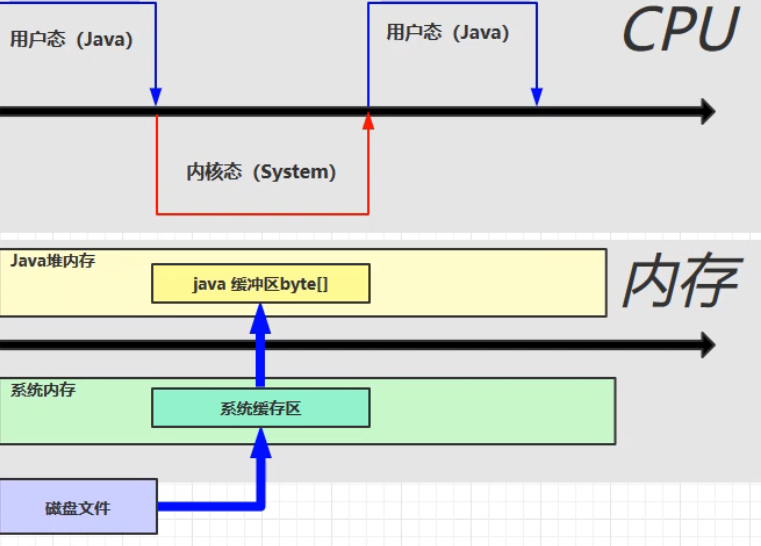

在使用NIO后，操作系统会创建一个直接内存，该内存不仅操作系统可以调用，JVM也可以调用，省去了将操作系统内存缓冲区内存复制到JVM堆缓冲区的时间。

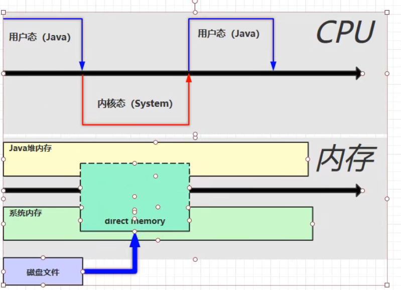

> NIO
> 
> New IO、Java Non-blocking IO，是指jdk1.4 及以上版本里提供的新api（New IO） ，为所有的原始类型（boolean类型除外）提供缓存支持的数据容器，使用它可以提供非阻塞式的高伸缩性网络。
> 
> 可以替代标准的 Java IO API。NIO 与原来的 IO 有同样的作用和目的，但是使用方式完全不同，NIO 支持面向缓冲区的、基于通道的 IO 操作。NIO 将以更加高效的方式进行文件的读写操作。
> 
> **NIO三大组件：Channel、Buffer、Selector**
> 
> 
> 
> 参考地址：
> 
> [Java 中 NIO 看这一篇就够了 - 知乎 (zhihu.com)](https://zhuanlan.zhihu.com/p/369062109)
> 
> [java基础之NIO介绍及使用_java_脚本之家 (jb51.net)](https://www.jb51.net/article/211036.htm)
> 
> [IO 模型详解 | JavaGuide](https://javaguide.cn/java/basis/io.html)

### 直接内存的内存溢出

直接内存也会发生溢出，当我们不断的申请直接内存，并最终超过最大的内存限制（可以通过JVM参数指定），就会发生JVM直接内存溢出。

### 直接内存的释放原理

直接内存的申请与释放是由JDK中一个叫`Unsafe`的对象通过`allcateMemory`方法和`freeMemory`方法来管理的，并不是通过JVM的垃圾回收机制来管理。NIO中的ByteBuffer就是通过unsafe对象来实现对直接内存的申请和释放。ByteBuffffer 的实现类内部，使用了 Cleaner （虚引用）来监测 ByteBuffffer 对象，一旦ByteBuffffer 对象被垃圾回收，那么就会由 ReferenceHandler 线程通过 Cleaner 的 clean 方法调用 freeMemory 来释放直接内存。

获得Unsafe对象的方式如下：(Unsafe对象的所在包是`sun.misc.Unsafe;`)

```java
public static Unsafe getUnsafe(){
    try{
        Field f = Unsafe.class.getDeclaredField("theUnsafe");
        f.setAccessible(true);
        Unsafe unsafe = (Unsafe)f.get(null);
        return unsafe;
    }catch(NoSuchFieldException | IllegalAccessException e) {
        throw new RuntimeException(e);
    }
}
```

### 禁用显示内存回收对直接内存的影响

使用如下JVM参数可以禁用显示的内存回收，即使得代码中的`System.gc()`失效。

```bash
-XX:+DisableExplicitGC 
```

如果是通过使用System.gc()的方式来使得ByteBuffer对象被垃圾回收，从而使得直接内存被释放，此时如果启用了`-XX:+DisableExplicitGC`参数，就会导致直接内存无法被释放（至少是在JVM没有主动GC前无法被释放），遇到这种情况可以手动通过Unsafe对象来释放直接内存。

# 垃圾回收

## 判断对象是否可以回收

判断对象是否可以回收有一下两种算法

### 引用计数法

为每个对象创建一个创建一个引用计数，每多一个变量引用该对象，该对象的引用计数就将会加1。当对象的引用计数为0后，该对象便会被回收掉。

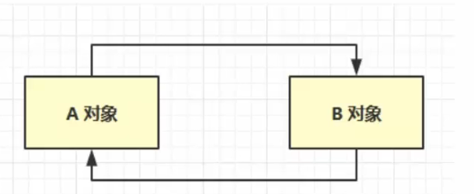

如果出现循环引用，即A对象引用了B对象，同时B对象又引用了A对象，及时这两个对象不再被其他变量引用，这两个的对象的引用计数依旧都为1，无法被垃圾回收。

早起的Python虚拟机采用了该算法。**JVM并没有采用该算法。**

### 可达性分析算法

可达性分析算法要确定根对象。根对象简单说就是肯定不能被垃圾回收的对象。在执行垃圾回收时，JVM会扫描一遍堆。堆中没有被根对象直接或者间接引用的对象就会被垃圾回收掉。

#### 根对象（GC Root）

以下几种对象可以作为根对象

**System Class**

一些系统类，这些系统类的对象由启动类加载器加载，是一些核心的类

**Native Stack**

本地方法（操作系统方法）执行时所引用的一些Java对象，即本地方法栈所引用的对象

**Busy Monitor**

被synchronzied加锁的对象，不能被垃圾回收，这类对象也是根对象。

**Thread**

活动的线程对象，和线程中所引用的一些对象

### 四种引用

**强引用**

在 Java 中最常见的就是强引用，把一个对象赋给一个引用变量，这个引用变量就是一个强引用。强引用是最传统的“引用”的定义，是指在程序代码之中普遍存在的引用赋值，即类似`Object obj = new Object()`这种引用关系。

无论任何情况下，只要强引用关系还存在，垃圾收集器就永远不会回收掉被引用的对象。即使该对象以后永远都不会被用到， JVM 也不会回收。因此强引用是造成 Java 内存泄漏的主要原因之一。

**软引用**

软引用是用来描述一些还有用，但非必须的对象。只被软引用关联着的对象，在系统将要发生内存溢出异常前，会把这些对象列进回收范围之中进行第二次回收，如果这次回收还没有足够的内存，才会抛出内存溢出异常。

软引用通常用来实现内存敏感的缓存。比如：高速缓存就有用到软引用。如果还有空闲内存，就可以暂时保留缓存，当内存不足时清理掉，这样就保证了使用缓存的同时，不会耗尽内存。

在JDK 1.2版之后提供了SoftReference类来实现软引用。垃圾回收器在某个时刻决定回收软可达的对象的时候，会清理软引用，如果软引用关联了引用队列，JVM会把引用（即SoftReference类的实例）存放到一个引用队列（Reference Queue）。

```java
//构造软引用
SoftReference<byte[]> ref = new SoftReference<>(new byte[1]);
//得到软引用的对象
System.out.println(ref.get());
```

```java
/*配合引用队列使用*/
//引用队列
ReferenceQueue<byte[]> queue = new ReferenceQueue<>();
//关联了引用队列，当软引用所关联的 byte[]被回收时，软引用自己会加入到queue中去
SoftReference<byte[]> ref = new SoftReference<>(new byte[1], queue);
```

**弱引用**

弱引用也是用来描述那些非必须对象，但是它的强度比软引用更弱一些，被弱引用关联的对象只能生存到下一次垃圾收集发生为止。当垃圾收集器开始工作，无论当前内存是否足够，都会回收掉只被弱引用关联的对象。

但是，由于垃圾回收器的线程通常优先级很低，因此，并不一定能很快地发现持有弱引用的对象。在这种情况下，弱引用对象可以存在较长的时间。

弱引用和软引用一样，在构造弱引用时，也可以指定一个引用队列，当弱引用对象被回收时，就会加入指定的引用队列，通过这个队列可以跟踪对象的回收情况。

软引用、弱引用都非常适合来保存那些可有可无的缓存数据。如果这么做，当系统内存不足时，这些缓存数据会被回收，不会导致内存溢出。而当内存资源充足时，这些缓存数据又可以存在相当长的时间，从而起到加速系统的作用。

在 JDK 1.2版之后提供了WeakReference类来实现弱引用。

**虚引用**

虚引用也称为“幽灵引用”或者“幻影引用”，它是最弱的一种引用关系。一个对象是否有虚引用的存在，完全不会对其生存时间构成影响，**它不能单独使用，也无法通过虚引用来获取被引用的对象。当试图通过虚引用的 get()方法取得对象时，总是 null**。为一个对象设置虚引用关联的唯一目的只是为了能在这个对象被收集器回收时收到一个系统通知。

**虚引用必须和引用队列一起使用。** （软引用和弱引用也可以和引用队列一起使用，但这是可选的，不是必须的。）虚引用在创建时必须提供一个引用队列作为参数。当垃圾回收器准备回收一个对象时，如果发现它还有虚引用，就会在回收对象后，将这个虚引用加入引用队列，以通知应用程序对象的回收情况。

由于虚引用可以跟踪对象的回收时间，因此，也可以将一些资源释放操作放置在虚引用中执行和记录。

在JDK 1.2版之后提供了PhantomReference类来实现虚引用。

**终结器引用**

它用于实现对象的 finalize() 方法，也可以称为终结器引用。无需手动编码，其内部配合引用队列使用。在 GC 时，终结器引用入队。由 Finalizer 线程通过终结器引用找到被引用对象调用它的 finalize()方法，第二次 GC 时才回收被引用的对象。

即使在可达性分析算法中判定为不可达的对象，也不是“非死不可”的，这时候它们暂时还处于“缓刑”阶段，要真正宣告一个对象死亡，至少要经历两次标记过程:

1.如果对象在进行可达性分析后发现没有与GC Roots相连接的引用链，那它将会被第一次标记

2.随后进行一次筛选，筛选的条件是此对象是否有必要执行finalize()方法。假如对象没有覆盖finalize()方法，或者finalize()方法已经被虚拟机调用过，那么虚拟机将这两种情况都视为“没有必要执行”。

如果这个对象被判定为确有必要执行finalize()方法，那么该对象将会被放置在一个名为F-Queue的队列之中，并在稍后由一条由虚拟机自动建立的、低调度优先级的Finalizer线程去执行它们的finalize()方法。这里所说的“执行”是指虚拟机会触发这个方法开始运行，但并不承诺一定会等待它运行结束。这样做的原因是，如果某个对象的 finalize()方法执行缓慢，或者更极端地发生了死循环，将很可能导致F-Queue队列中的其他对象永久处于等待，甚至导致整个内存回收子系统的崩溃。finalize()方法是对象逃脱死亡命运的最后一次机会，稍后收集器将对F-Queue中的对象进行第二次小规模的标记，如果对象要在finalize()中成功拯救自己——只要重新与引用链上的任何一个对象建立关联即可，譬如把自己(this关键字)赋值给某个类变量或者对象的成员变量，那在第二次标记时它将被移出"即将回收”的集合;如果对象这时候还没有逃脱，那基本上它就真的要被回收了。

还有一点需要特别说明，上面关于对象死亡时 finalize()方法的描述可能带点悲情的艺术加工，笔者并不鼓励大家使用这个方法来拯救对象。相反，笔者建议大家尽量避免使用它，因为它并不能等同于C和C++语言中的析构函数，而是Java刚诞生时为了使传统C、C++程序员更容易接受Java所做出的一项妥协。它的运行代价高昂，不确定性大，无法保证各个对象的调用顺序，如今已被官方明确声明为不推荐使用的语法。有些教材中描述它适合做“关闭外部资源”之类的清理性工作，这完全是对finalize()方法用途的一种自我安慰。finalize()能做的所有工作，使用try-finally或者其他方式都可以做得更好、更及时，所以笔者建议大家完全可以忘掉Java语言里面的这个方法。

## 垃圾回收算法

### 标记-清除算法

最早出现也是最基础的垃圾收集算法是“标记–清除”( Mark-Sweep）算法，在1960年由Lisp之父John McCarthy所提出。如它的名字一样，算法分为“标记”和“清除”两个阶段:首先标记出所有需要回收的对象，在标记完成后，统一回收掉所有被标记的对象，也可以反过来，标记存活的对象，统一回收所有未被标记的对象。

根据可达性分析算法，先将要清除的对象进行标记，而后再将标记的对象清除。清除是指将要被清除对象的起始地址和结束地址加入空闲地址列表。而后该地址空间便可以被其他对象覆盖。
之所以说它是最基础的收集算法，是因为后续的收集算法大多都是以标记–清除算法为基础，对其缺点进行改进而得到的。它的主要缺点有两个:

第一个是执行效率不稳定,如果Java堆中包含大量对象，而且其中大部分是需要被回收的，这时必须进行大量标记和清除的动作，导致标记和清除两个过程的执行效率都随对象数量增长而降低;

第二个是内存空间的碎片化问题，标记、清除之后会产生大量不连续的内存碎片，空间碎片太多可能会导致当以后在程序运行过程中需要分配较大对象时无法找到足够的连续内存而不得不提前触发另一次垃圾收集动作。标记–清除算法的执行过程如下图所示。


### 标记-复制算法

标记–复制算法常被简称为复制算法。为了解决标记–清除算法面对大量可回收对象时执行效率低的问题，1969年Fenichel提出了一种称为“半区复制”( Semispace Copying)的垃圾收集算法。

它将可用内存按容量划分为大小相等的两块，每次只使用其中的一块。当这一块的内存用完了，就将还存活着的对象复制到另外一块上面，然后再把已使用过的内存空间一次清理掉。

如果内存中多数对象都是存活的，这种算法将会产生大量的内存间复制的开销，但对于多数对象都是可回收的情况，算法需要复制的就是占少数的存活对象,而且每次都是针对整个半区进行内存回收，分配内存时也就不用考虑有空间碎片的复杂情况，只要移动堆顶指针，按顺序分配即可。这样实现简单，运行高效，不过其缺陷也显而易见，这种复制回收算法的代价是将可用内存缩小为了原来的一半，空间浪费未免太多了一点。标记-复制算法的执行过程如下图所示。

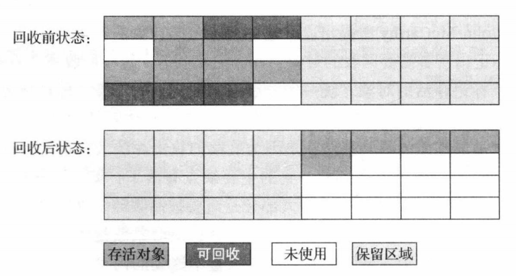

### 标记-整理算法

1974年 Edward Lueders提出了另外一种有针对性的“标记–整理”( Mark-Compact)算法，其中的标记过程仍然与“标记–清除”算法一样，但后续步骤不是直接对可回收对象进行清理，而是让所有存活的对象都向内存空间一端移动，然后直接清理掉边界以外的内存,“标记–整理”算法的示意图如图所示。

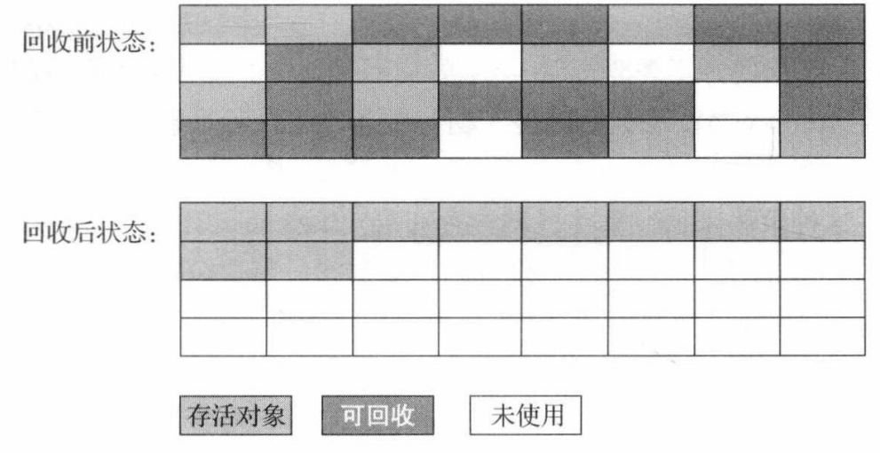

标记–清除算法与标记–整理算法的本质差异在于前者是一种非移动式的回收算法，而后者是移动式的。是否移动回收后的存活对象是一项优缺点并存的风险决策。

## 分带收集理论

当前商业虚拟机的垃圾收集器，大多数都遵循了“分代收集”(Generational Collection)的理论进行设计，分代收集名为理论，实质是一套符合大多数程序运行实际情况的经验法则,它建立在三个分代假说之上:
1）弱分代假说(Weak Generational Hypothesis):绝大多数对象都是朝生夕灭的。

2）强分代假说（Strong Generational Hypothesis):熬过越多次垃圾收集过程的对象就越难以消亡。

3）跨代引用假说(Intergenerational Reference Hypothesis):跨代引用相对于同代引用来说仅占极少数。

这三个分代假说共同奠定了多款常用的垃圾收集器的一致的设计原则:收集器应该将Java堆划分出不同的区域，然后将回收对象依据其年龄（年龄即对象熬过垃圾收集过程的次数）分配到不同的区域之中存储。显而易见，如果一个区域中大多数对象都是朝生夕灭,难以熬过垃圾收集过程的话，那么把它们集中放在一起，每次回收时只关注如何保留少量存活而不是去标记那些大量将要被回收的对象，就能以较低代价回收到大量的空间;如果剩下的都是难以消亡的对象，那把它们集中放在一块，虚拟机便可以使用较低的频率来回收这个区域，这就同时兼顾了垃圾收集的时间开销和内存的空间有效利用。
在Java堆划分出不同的区域之后，垃圾收集器才可以每次只回收其中某一个或者某些部分的区域——因而才有了“Minor GC"“Major GC”“Full GC”这样的回收类型的划分;也才能够针对不同的区域安排与里面存储对象存亡特征相匹配的垃圾收集算法—─因而发展出了“标记–复制算法”“标记–清除算法”“标记-整理算法”等针对性的垃圾收集算法。

把分代收集理论具体放到现在的商用Java 虚拟机里，设计者一般至少会把 Java堆划分为新生代( Young Generation)和老年代(Old Generation)两个区域。顾名思义，在新生代中，每次垃圾收集时都发现有大批对象死去，而每次回收后存活的少量对象，将会逐步晋升到老年代中存放。

> 部分收集( Partial GC):指目标不是完整收集整个Java堆的垃圾收集，其中又分为:
> 新生代收集(Minor GC/Young GC):指目标只是新生代的垃圾收集。
> 老年代收集（Major GC/Old GC):指目标只是老年代的垃圾收集。
> 
> 目前只有CMS收集器会有单独收集老年代的行为。另外请注意“Major GC”这个说法现在有点混淆，在不同资料上常有不同所指，读者需按上下文区分到底是指老年代的收集还是整堆收集。
> 混合收集( Mixed GC):指目标是收集整个新生代以及部分老年代的垃圾收集。目前只有Gl收集器会有这种行为。
> 整堆收集（Full GC):收集整个Java堆和方法区的垃圾收集。

### 新生代的垃圾回收

现在的商用Java 虚拟机大多都优先采用了**标记-复制算法**去回收新生代，IBM公司曾有一项专门研究对新生代“朝生夕灭”的特点做了更量化的诠释——新生代中的对象有98%熬不过第一轮收集。因此并不需要按照1∶1的比例来划分新生代的内存空间。
在1989年，Andrew Appel针对具备“朝生夕灭”特点的对象，提出了一种更优化的半区复制分代策略，现在称为“Appel式回收”（即标记-复制算法）。HotSpot 虚拟机的Serial、ParNew等新生代收集器均采用了这种策略来设计新生代的内存布局。Appel式回收的具体做法是把新生代分为一块较大的Eden空间和两块较小的Survivor空间，每次分配内存只使用Eden和其中一块Survivor。

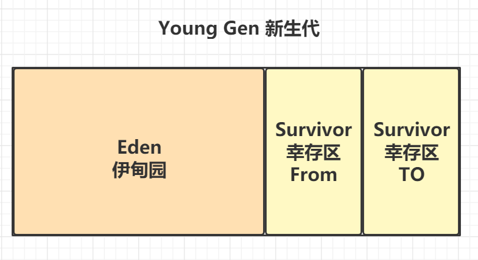

发生垃圾搜集时，将Eden和Survivor中仍然存活的对象一次性复制到另外一块Survivor空间上，然后直接清理掉Eden和已用过的那块Survivor空间。HotSpot虚拟机默认Eden和 Survivor的大小比例是8∶1，也即每次新生代中可用内存空间为整个新生代容量的90%( Eden的80%加上一个Survivor的10%)，只有一个 Survivor 空间，即10%的新生代是会被“浪费”的。当然，98%的对象可被回收仅仅是“普通场景”下测得的数据，任何人都没有办法百分百保证每次回收都只有不多于10%的对象存活，因此Appel式回收
还有一个充当罕见情况的“逃生门”的安全设计，当Survivor空间不足以容纳一次MinorGC之后存活的对象时，就需要依赖其他内存区域(实际上大多就是老年代)进行分配担保(Handle Promotion)。如果另外一块Survivor空间没有足够空间存放上一次新生代收集下来的存活对象，这些对象便将通过分配担保机制直接进入老年代，这对虚拟机来说就是安全的。

### 老年代的垃圾回收

针对老年代对象的存亡特征，1974年 Edward Lueders提出了另外一种有针对性的“标记–整理”(Mark-Compact)算法，其中的标记过程仍然与“标记–清除”算法一样，但后续步骤不是直接对可回收对象进行清理，而是让所有存活的对象都向内存空间―端移动，然后直接清理掉边界以外的内存。

标记–清除算法与标记–整理算法的本质差异在于前者是一种非移动式的回收算法，而后者是移动式的。是否移动回收后的存活对象是一项优缺点并存的风险决策:

如果移动存活对象，尤其是在老年代这种每次回收都有大量对象存活区域，移动存活对象并更新所有引用这些对象的地方将会是一种极为负重的操作，而且这种对象移动操作必须全程暂停用户应用程序才能进行，这就更加让使用者不得不小心翼翼地权衡其弊端了，像这样的停顿被最初的虚拟机设计者形象地描述为“Stop The World”。

但如果跟标记–清除算法那样完全不考虑移动和整理存活对象的话，弥散于堆中的存活对象导致的空间碎片化问题就只能依赖更为复杂的内存分配器和内存访问器来解决。譬如通过“分区空闲分配链表”来解决内存分配问题（计算机硬盘存储大文件就不要求物理连续的磁盘空间，能够在碎片化的硬盘上存储和访问就是通过硬盘分区表实现的)。内存的访问是用户程序最频繁的操作，甚至都没有之一，假如在这个环节上增加了额外的负担，势必会直接影响应用程序的吞吐量。
基于以上两点，是否移动对象都存在弊端，移动则内存回收时会更复杂，不移动则内存分配时会更复杂。从垃圾收集的停顿时间来看，不移动对象停顿时间会更短，甚至可以不需要停顿，但是从整个程序的吞吐量来看，移动对象会更划算。此语境中，吞吐量的实质是赋值器（Mutator，可以理解为使用垃圾收集的用户程序，本书为便于理解，多数地方用“用户程序”或“用户线程”代替）与收集器的效率总和。即使不移动对象会使得收集器的效率提升一些，但因内存分配和访问相比垃圾收集频率要高得多，这部分的耗时增加，总吞吐量仍然是下降的。HotSpot虚拟机里面关注吞吐量的Parallel Scavenge收集器是基于标记–整理算法的，而关注延迟的CMS收集器则是基于标记–清除算法的，这也从侧面印证这点。

另外，还有一种“和稀泥式”解决方案可以不在内存分配和访问上增加太大额外负担，做法是让虚拟机平时多数时间都采用标记–清除算法，暂时容忍内存碎片的存在，直到内存空间的碎片化程度已经大到影响对象分配时，再采用标记–整理算法收集一次，以获得规整的内存空间。前面提到的基于标记–清除算法的CMS收集器面临空间碎片过多时采用的就是这种处理办法。

### 一个线程OOM，同一个进程里另一个线程还会正常运行吗？

**会正常运行**

OOM最常见的就是堆内存溢出

```java
java.lang.OutOfMemoryError: Java heap space
```

> **在多线程环境下，每个线程拥有一个栈和一个程序计数器。栈和程序计数器用来保存线程的执行历史和线程的执行状态，是线程私有的资源。其他的资源（比如堆、地址空间、全局变量）是由同一个进程内的多个线程共享。**

当一个线程抛出OOM异常后，它所占据的内存资源会全部被释放掉（无论是堆内存还是栈内存都会被释放掉），从而不会影响其他线程的运行。**所以一个线程溢出后，进程里的其他线程还能照常运行**

即便是主线程抛异常退出了，子线程也还能运行。  但是有一个例外情况，如果这些子线程都是守护线程，那么子线程会随着主线程结束而结束。

## 经典垃圾收集器

如果说收集算法是内存回收的方法论，那垃圾收集器就是内存回收的实践者。《Java虚拟机规范》中对垃圾收集器应该如何实现并没有做出任何规定，因此不同的厂商、不同版本的虚拟机所包含的垃圾收集器都可能会有很大差别，不同的虚拟机一般也都会提供各种参数供用户根据自己的应用特点和要求组合出各个内存分代所使用的收集器。
本节标题中“经典”二字并非情怀，它其实是讨论范围的限定语，这里讨论的是在JDK 7 Update 4之后(在这个版本中正式提供了商用的G1收集器，此前G1仍处于实验状态)、JDK 11正式发布之前，OracleJDK中的HotSpot虚拟机所包含的可用的垃圾收集器。

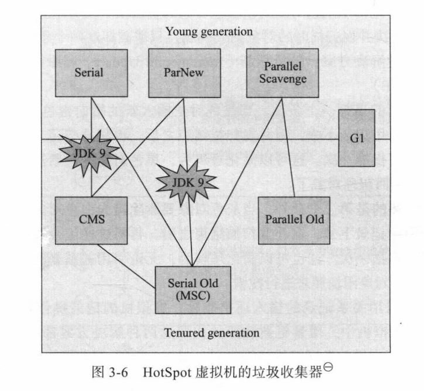

上图展示了七种作用于不同分代的收集器，如果两个收集器之间存在连线，就说明它们可以搭配使用，图中收集器所处的区域，则表示它是属于新生代收集器抑或是老年代收集器。

虽然垃圾收集器的技术在不断进步，但直到现在还没有最好的收集器出现，更加不存在“万能”的收集器，所以我们选择的只是对具体应用最合适的收集器。这点不需要多加论述就能证明:如果有一种放之四海皆准、任何场景下都适用的完美收集器存在，HotSpot虚拟机完全没必要实现那么多种不同的收集器了。

### 新生代收集器

#### Serial收集器

> 单线程的、串行的、标记-复制法

Serial 收集器是最基础、历史最悠久的收集器，曾经(在JDK 1.3.1之前)是HotSpot虚拟机新生代收集器的唯一选择。

大家只看名字就能够猜到，这个收集器是一个**单线程工作**的收集器，但它的“单线程”的意义并不仅仅是说明**它只会使用一个处理器或一条收集线程去完成垃圾收集工作**，更重要的是强调在它进行垃圾收集时，必须暂停其他所有工作线程，直到它收集结束。**“Stop The World”**(STW)这个词语也许听起来很酷，但这项工作是由虚拟机在后台自动发起和自动完成的，在用户不可知、不可控的情况下把用户的正常工作的线程全部停掉，这对很多应用来说都是不能接受的。


迄今为止，它依然是HotSpot虚拟机运行在客户端模式下的默认新生代收集器，有着优于其他收集器的地方，那就是简单而高效(与其他收集器的单线程相比)，对于内存资源受限的环境，它是所有收集器里额外内存消耗( Memory Footprint)最小的;对于单核处理器或处理器核心数较少的环境来说，Serial收集器由于没有线程交互的开销，专心做垃圾收集自然可以获得最高的单线程收集效率。在用户桌面的应用场景以及近年来流行的部分微服务应用中，分配给虚拟机管理的内存一般来说并不会特别大，收集几十兆甚至一两百兆的新生代(仅仅是指新生代使用的内存，桌面应用甚少超过这个容量)，垃圾收集的停顿时间完全可以控制在十几、几十毫秒，最多一百多毫秒以内，只要不是频繁发生收集，这点停顿时间对许多用户来说是完全可以接受的。所以，Serial 收集器对于运行在客户端模式下的虚拟机来说是一个很好的选择。

#### ParNew收集器

> 多线程的、标记-复制法

ParNew收集器实质上是Serial 收集器的多线程并行版本，除了同时使用多条线程进行垃圾收集之外，其余的行为包括Serial收集器可用的所有控制参数（例如:-XX:SurvivorRatio、-XX:PretenureSizeThreshold、-XX:HandlePromotionFailure等)、收集算法、Stop The World、对象分配规则、回收策略等都与Serial 收集器完全一致，在实现上这两种收集器也共用了相当多的代码。ParNew 收集器的工作过程如图所示。


#### Parallel Scavenge收集器

> 多线程的、标记-复制法、吞吐量优先

Parallel Scavenge收集器也是一款新生代收集器，它同样是基于标记–复制算法实现的收集器，也是能够并行收集的多线程收集器……Parallel Scavenge的诸多特性从表面上看和ParNew非常相似，那它有什么特别之处呢?
Parallel Scavenge 收集器的特点是它的关注点与其他收集器不同，CMS等收集器的关注点是尽可能地缩短垃圾收集时用户线程的停顿时间，而Parallel Scavenge收集器的目标则是达到一个可控制的吞吐量(Throughput)。所谓吞吐量就是处理器用于运行用户代码的时间与处理器总消耗时间的比值，即:


即，希望单位时间内，STW的时间更加低。

### 老年代收集器

#### Serial Old收集器

> 单线程的、标记-整理算法

Serial Old是Serial 收集器的老年代版本，它同样是一个单线程收集器，使用标记-整理算法。这个收集器的主要意义也是供客户端模式下的HotSpot 虚拟机使用。如果在服务端模式下，它也可能有两种用途:一种是在JDK 5以及之前的版本中与Parallel Scavenge 收集器搭配使用，另外一种就是作为CMS收集器发生失败时的后备预案，在并发收集发生Concurrent Mode Failure时使用。Serial Old收集器的工作过程如图所示。


#### Parallel Old收集器

> 多线程的、标记-整理算法

Parallel Old是Parallel Scavenge收集器的老年代版本，支持多线程并发收集,基于标记-整理算法实现。这个收集器是直到JDK6时才开始提供的，在此之前，新生代的 Parallel Scavenge收集器一直处于相当尴尬的状态，原因是如果新生代选择了ParallelScavenge收集器，老年代除了Serial Old ( PS MarkSweep)收集器以外别无选择，其他表现良好的老年代收集器，如CMS无法与它配合工作。由于老年代Serial Old收集器在服务端应用性能上的“拖累”，使用Parallel Scavenge收集器也未必能在整体上获得吞吐量最大化的效果。同样，由于单线程的老年代收集中无法充分利用服务器多处理器的并行处理能力，在老年代内存空间很大而且硬件规格比较高级的运行环境中，这种组合的总吞吐量甚至不一定比ParNew 加 CMS的组合来得优秀。直到Parallel Old收集器出现后，“吞吐量优先”收集器终于有了比较名副其实的搭配组合，在注重吞吐量或者处理器资源较为稀缺的场合，都可以优先考虑Parallel Scavenge加Parallel Old 收集器这个组合。Parallel Old 收集器的工作过程如图所示。


#### CMS收集器

> 多线程的、标记-清除算法

CMS ( Concurrent Mark Sweep）收集器是一种以获取最短回收停顿时间为目标的收集器。目前很大一部分的Java应用集中在互联网网站或者基于浏览器的B/S系统的服务端上，这类应用通常都会较为关注服务的响应速度，希望系统停顿时间尽可能短。以给用户带来良好的交互体验。CMS 收集器就非常符合这类应用的需求。从名字(包含“Mark Sweep”)上就可以看出CMS 收集器是基于标记–清除算法实现的，它的运作过程相对于前面几种收集器来说要更复杂一些，整个过程分为四个步骤，包括:

1）初始标记(CMS initial mark)（需要STW）

2）并发标记(CMS concurrent mark)

3）重新标记(CMS remark)（需要STW）

4）并发清除(CMS concurrent sweep)

其中初始标记、重新标记这两个步骤仍然需要“Stop The World”。初始标记仅仅只是标记一下GC Roots能直接关联到的对象，速度很快;并发标记阶段就是从GC Roots 的直接关联对象开始遍历整个对象图的过程，这个过程耗时较长但是不需要停顿用户线程，可以与垃圾收集线程一起并发运行;而重新标记阶段则是为了修正并发标记期间，因用户程序继续运作而导致标记产生变动的那一部分对象的标记记录，这个阶段的停顿时间通常会比初始标记阶段稍长一些，但也远比并发标记阶段的时间短;最后是并发清除阶段，清理删除掉标记阶段判断的已经死亡的对象，由于不需要移动存活对象，所以这个阶段也是可以与用户线程同时并发的。

由于在整个过程中耗时最长的并发标记和并发清除阶段中，垃圾收集器线程都可以与用户线程一起工作，所以从总体上来说，CMS收集器的内存回收过程是与用户线程一起并发执行的。通过图可以比较清楚地看到CMS收集器的运作步骤中并发和需要停顿的阶段。


### Garbage First(G1) 收集器

> 标记复制、标记整理

Garbage First(简称G1)收集器是垃圾收集器技术发展历史上的里程碑式的成果。它开创了收集器面向局部收集的设计思路和基于Region的内存布局形式。它主要面向服务器端的应用。在JDK9之后成为默认的垃圾收集器。

G1是一款基于“停顿时间模型”(Pause Prediction Model)的收集器，停顿时间模型的息思定能够支持指定在一个长度为M毫秒的时间片段内，消耗在垃圾收集上的时间大概率不超过N毫秒这样的目标，这几乎已经是实时Java (RTSJ)的中软实时垃圾收集器特征了。

在G1收集器出现之前的所有其他收集器，包括CMS在内，垃圾收集的目标范围要么是整个新生代( MinorGC)，要么就是整个老年代(Major GC)，再要么就是整个Java堆（Full GC)。而G1跳出了这个樊笼，它可以面向堆内存任何部分来组成回收集(Collection Set，一般简称CSet)进行回收，衡量标准不再是它属于哪个分代，而是哪块内存中存放的垃圾数量最多，回收收益最大，这就是G1收集器的**Mixed GC**模式。

G1开创的基于Region 的堆内存布局是它能够实现这个目标的关键。虽然G1也仍是遵循分代收集理论设计的，但其堆内存的布局与其他收集器有非常明显的差异:G1不再坚持固定大小以及固定数量的分代区域划分，而是把连续的Java堆划分为多个大小相等的独立区域(Region)，每一个Region都可以根据需要，扮演新生代的Eden 空间、Survivor空间,或者老年代空间。收集器能够对扮演不同角色的Region采用不同的策略去处理，这样无论是新创建的对象还是已经存活了一段时间、熬过多次收集的旧对象都能获取很好的收集效果。

Region中还有一类特殊的 Humongous区域，专门用来存储大对象G1认为只要大小超过了一个Region容量一半的对象即可判足为大对象。而对于那些超过了整个Region容量的超级大对象，将会被存放在N个连续的Humongous Region之中，G1的大多数行为都把 Humongous Region作为老年代的一部分来进行待。

虽然G1仍然保留新生代和老年代的概念，但新生代和老年代不再是固定的了，它们都是一系列区域(不需要连续)的动态集合。G1收集器之所以能建立可预测的停顿时间模型,是因为它将Region作为单次回收的最小单元，即每次收集到的内存空间都是Region大小的整数倍，这样可以有计划地避免在整个Java堆中进行全区域的垃圾收集。更具体的处理思路是让G1收集器去跟踪各个Region里面的垃圾堆积的“价值”大小，价值即回收所获得的空间大小以及回收所需时间的经值，然后在后台维护一个优先级列表，每次根据用户设定允许的收集停顿时间（使用参数-XX:MaxGCPauseMillis指定，默认值是200毫秒),优先处理回收价值收益最大的那些Region，这也就是“Garbage First" 名字的由来。这种使用Region划分内存空间，以及具有优先级的区域回收方式，保让了G1 收集器在有限的时间内获取尽可能高的收集效率。


如果我们不去计算用户线程运行过程中的动作（如使用写屏障维护记忆集的操作)，G1收集器的运作过程大致可划分为以下四个步骤:

1.初始标记(Initial Marking ):仅仅只是标记一下GC Roots能直接关联到的对象并且修改TAMS指针的值，让下一阶段用户线程并发运行时，能正确地在可用的Region中分配新对象。这个阶段需要停顿线程，但耗时很短，而且是借用进行Minor GC的时候同步完成的，所以G1收集器在这个阶段实际并没有额外的停顿。

2.并发标记(Concurrent Marking ):从 GC Root开始对堆中对象进行可达性分析，递归扫描整个堆里的对象图，找出要回收的对象，这阶段耗时较长，但可与用户程序并发执行。当对象图扫描完成以后，还要重新处理SATB记录下的在并发时有引用变动的对象。

3.最终标记（Final Marking ):对用户线程做另一个短暂的暂停，用于处理并发阶段结束后仍遗留下来的最后那少量的SATB记录。

4.筛选回收(Live Data Counting and Evacuation):负责更新Region 的统计数据，对各个Region的回收价值和成本进行排序，根据用户所期望的停顿时间来制定回收计划，可以自由选择任意多个Region构成回收集，然后把决定回收的那一部分Region的存活对象复制到空的Region中，再清理掉整个旧Region 的全部空间。这里的操作涉及存活对象的移动，是必须暂停用户线程，由多条收集器线程并行完成的。

从上述阶段的描述可以看出，G1收集器除了并发标记外，其余阶段也是要完全暂停用户线程的，换言之，它并非纯粹地追求低延迟，官方给它设定的目标是在延迟可控的情况下获得尽可能高的吞吐量，所以才能担当起“全功能收集器”的重任与期望。

与CMS的“标记–清除”算法不同，G1从整体来看是基于“标记-整理”算法实现的收集器，但从局部(两个Region 之间)上看是基于“标记-复制”算法实现的，无论如何，这两种算法都意味着G1运作期间不会产生内存空间碎片，垃圾收集完成之后能提供规整的可用内存。这种特性有利于程序长时间运行，在程序为大对象分配内存时不容易因无法找到连续内存空间而提前触发下一次收集。


CMS和G1执行流程的对比

| 阶段   | CMS                        | 是否需要STW | 用途                                                    | G1                                      | 用途                                                                                                                                                                               | 是否需要STW |
| ---- | -------------------------- | ------- | ----------------------------------------------------- | --------------------------------------- | -------------------------------------------------------------------------------------------------------------------------------------------------------------------------------- | ------- |
| 第一阶段 | 初始标记(CMS initial mark)     | 需要      | 标记一下GC Roots能直接关联到的对象                                 | 初始标记(Initial Marking)                   | 标记一下GC Roots能直接关联到的对象                                                                                                                                                            | 需要      |
| 第二阶段 | 并发标记(CMS concurrent mark)  | 不需要     | 从GC Roots 遍历整个对象图                                     | 并发标记(Concurrent Marking):               | 从 GC Root遍历整个对象图                                                                                                                                                                 | 不需要     |
| 第三阶段 | 重新标记(CMS remark)           | 需要      | 修正并发标记期间，因用户程序继续运作而导致标记产生变动的那一部分对象的标记记录               | 最终标记（Final Marking )                    | 对用户线程做另一个短暂的暂停，用于处理并发阶段结束后仍遗留下来的最后那少量的SATB记录                                                                                                                                     | 需要      |
| 第四阶段 | 并发清除(CMS concurrent sweep) | 不需要     | 清理删除掉标记阶段判断的已经死亡的对象，由于不需要移动存活对象，所以这个阶段也是可以与用户线程同时并发的。 | 筛选回收(Live Data Counting and Evacuation) | 负责更新Region 的统计数据，对各个Region的回收价值和成本进行排序，根据用户所期望的停顿时间来制定回收计划，可以自由选择任意多个Region构成回收集，然后把决定回收的那一部分Region的存活对象复制到空的Region中，再清理掉整个旧Region 的全部空间。这里的操作涉及存活对象的移动，是必须暂停用户线程，由多条收集器线程并行完成的。 | 需要      |

## 内存分配与回收的基本流程

使用Serial和Serial Old收集器下的内存分配和回收策略。

1.对象优先在Eden区分配

大多数情况下，对象在新生代Eden区中分配。当Eden区没有足够空间进行分配时,虚拟机将发起一次Minor GC。
HotSpot虚拟机提供了-XX:+PrintGCDetails这个收集器日志参数，告诉虚拟机在发生垃圾收集行为时打印内存回收日志，并且在进程退出的时候输出当前的内存各区域分配情况。

2.大对象直接进入老年代

大对象就是指需要大量连续内存空间的Java对象，最典型的大对象便是那种很长的字符串，或者元素数量很庞大的数组。大对象对虚拟机的内存分配来说就是一个不折不扣的坏消息，比遇到一个大对象更加坏的消息就是遇到一群“朝生夕灭”的“短命大对象”，我们写程序的时候应注意避免。在Java虚拟机中要避免大对象的原因是，在分配空间时，它容易导致内存明明还有不少空间时就提前触发垃圾收集，以获取足够的连续空间才能安置好它们，而当复制对象时，大对象就意味着高额的内存复制开销。HotSpot 虚拟机提供了-XX:PretenureSizeThreshold参数，指定大于该设置值的对象直接在老年代分配，这样做的目的就是避免在Eden区及两个Survivor区之间来回复制，产生大量的内存复制作。

3.长期存活的对象将进入老年代

HotSpot虚拟机中多数收集器都采用了分代收集来管理堆内存，那内存回收时就必须能决策哪些存活对象应当放在新生代，哪些存活对象放在老年代中。为做到这点，虚拟机给每个对象定义了一个对象年龄(Age)计数器，存储在对象头中(详见深入理解Java虚拟机第三版第2章)。对象通常在Eden区里诞生，如果经过第一次Minor GC后仍然存活，并且能被Survivor容纳的话，该对象会被移动到Survivor空间中，并且将其对象年龄设为1岁。对象在Survivor区中每熬过一次 Minor GC，年龄就增加1岁，当它的年龄增加到一定程度（默认为15)，就会被晋升到老年代中。对象晋升老年代的年龄阈值，可以通过参数-XX:MaxTenuringThreshold设置。

4.动态对象年龄判定

为了能更好地适应不同程序的内存状况，HotSpot虚拟机并不是永远要求对象的年龄必须达到-XX:MaxTenuringThreshold才能晋升老年代，如果在Survivor空间中相同年龄所有对象大小的总和大于Survivor 空间的一半，年龄大于或等于该年龄的对象就可以直接进入老年代，无须等到-XX:MaxTenuringThreshold中要求的年龄。

5.空间分配担保

在发生 Minor GC之前，虚拟机必须先检查老年代最大可用的连续空间是否大于新生代所有对象总空间，如果这个条件成立，那这一次Minor GC可以确保是安全的。如果不成立，则虚拟机会先查看-XX:HandlePromotionFailure参数的设置值是否允许担保失败( Handle Promotion Failure );如果允许，那会继续检查老年代最大可用的连续空间是否大于历次晋升到老年代对象的平均大小，如果大于，将尝试进行一次Minor GC，尽管这次Minor GC是有风险的;如果小于，或者-XX:HandlePromotionFailure设置不允许冒险，那这时就要改为进行一次Full GC。

## 一次典型的对象内存分配和回收周期

1.对象被创建后首先在Eden中被分配


2.发生一次Minor GC，对象依旧存活，进入Survivor区


3.再发生一次MinorGC，对象依旧存活，被复制进入另外一个Survivor区


4.反复几次GC后，该对象的年龄达到15，进入老年代


5.该对象不再被引用，经过一次GC后，被垃圾收集器清除出堆内存。

# 类加载与字节码

实现语言无关性的基础是虚拟机和字节码存储格式。Java虚拟机不与包括Java语言在内的任何程序语言绑定，它只与“Class文件”这种特定的二进制文件格式所关联，Class文件中包含了Java虚拟机指令集、符号表以及若干其他辅助信息。基于安全方面的考虑，《Java虚拟机规范》中要求在Class文件必须应用许多强制性的语法和结构化约束，但图灵完备的字节码格式，保证了任意一门功能性语言都可以表示为一个能被Java虚拟机所接受的有效的Class文件。作为一个通用的、与机器无关的执行平台，任何其他语言的实现者都可以将Java虚拟机作为他们语言的运行基础，以 Class文件作为他们产品的交付媒介。例如，使用Java编译器可以把Java代码编译为存储字节码的Class文件，使用JRuby等其他语言的编译器一样可以把它们的源程序代码编译成Class文件。虚拟机丝毫不关心Class的来源是什么语言，它与程序语言之间的关系如图所示。

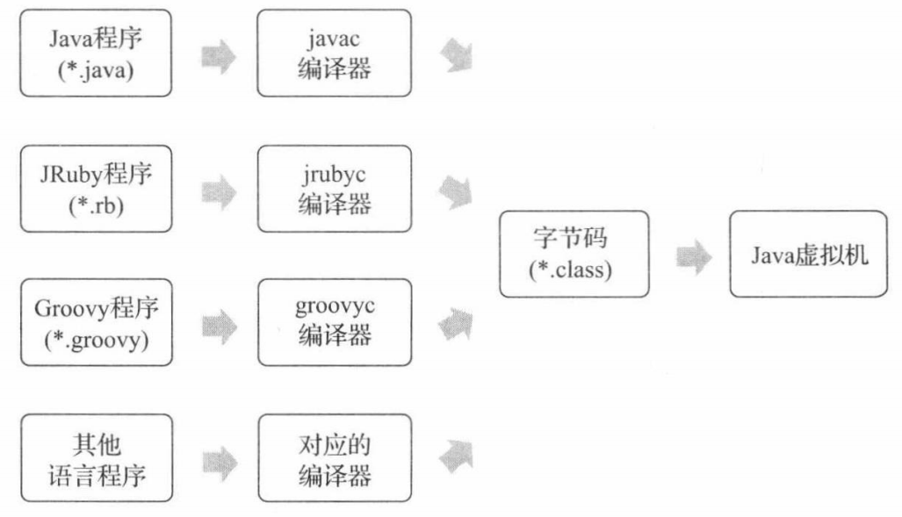

## 类文件结构

Class文件是一组以8个字节为基础单位的二进制流，各个数据项目严格按照顺序紧凑地排列在文件之中，中间没有添加任何分隔符，这使得整个Class文件中存储的内容几乎全部是程序运行的必要数据，没有空隙存在。当遇到需要占用8个字节以上空间的数据项时,则会按照高位在前的方式分割成若干个8个字节进行存储。

根据《Java 虚拟机规范》的规定，Class文件格式采用一种类似于C语言结构体的伪结构来存储数据，这种伪结构中只有两种数据类型:无符号数和表。

> + 无符号数属于基本的数据类型，以u1、u2、u4、u8来分别代表1个字节、2个字节、4个字节和8个字节的无符号数，无符号数可以用来描述数字、索引引用、数量值或者按照UTF-8编码构成字符串值。
> 
> + 表是由多个无符号数或者其他表作为数据项构成的复合数据类型，为了便于区分，所有表的命名都习惯性地以“_info”结尾。表用于描述有层次关系的复合结构的数据，整个Class文件本质上也可以视作是一张表，这张表由下图所示的数据项按严格顺序排列构成。

可参考资料：

[Java字节码的详细讲解-刘宇_Brycen Liu的博客-CSDN博客_java字节码详解](https://blog.csdn.net/liuyu973971883/article/details/120168986)


### 魔数（magic）

每个Class文件的头4个字节被称为魔数（Magic Number)，它的唯一作用是确定这个文件是否为一个能被虚拟机接受的Class文件。

> 不仅是Class文件，很多文件格式标准中都有使用魔数来进行身份识别的习惯，譬如图片格式，如GIF或者JPEG等在文件头中都存有魔数。使用魔数而不是扩展名来进行识别，主要是基于安全考虑，因为文件扩展名可以随意改动。文件格式的制定者可以自由地选择魔数值，只要这个魔数值还没有被广泛采用过而且不会引起混淆

Class文件的魔数取得很有“浪漫气息”，值为0xCAFEBABE(咖啡宝贝)。这个魔数值在Java还被称作“Oak"语言的时候(大约是1991年前后)就已经确定下来了。它还有一段很有趣的历史，据Java开发小组最初的关键成员Patrick Naughton所说:“我们一直在寻找一些好玩的、容易记忆的东西，选择0xCAFEBABE是因为它象征着著名咖啡品牌Peet's Coffee深受欢迎的 Baristas咖啡。这个魔数似乎也预示着日后“Java”这个商标名称的出现。

## JavaP工具

自己分析类文件结构太麻烦了，Oracle 提供了 javap 工具来反编译 class 文件

```batch
javap -v HelloWorld.class
```

`-v`是要求展示详细信息
