## SQL

### SQL的分类

DDL Data Definition Language 数据定义语言，用来定义数据库对象(数据库，表，字段)
DML Data Manipulation Language 数据操作语言，用来对数据库表中的数据进行增删改
DQL Data Query Language 数据查询语言，用来查询数据库中表的记录
DCL Data Control Language 数据控制语言，用来创建数据库用户、控制数据库的访问权限

### DDL

#### 数据库相关

查询所有数据库
`SHOW DATABASES`;
查询当前数据库
`SELECT DATABASE();`
创建
`CREATE DATABASE [ IF NOT EXISTS ] 数据库名[DEFAULT CHARSET 字符集][ COLLATE排序规则];`

删除
`DROP DATABASE [ IF EXISTS]数据库名;`
使用
`USE 数据库名;`

##### 关于字符集

字符集规定了字符在数据库中的存储格式，比如占多少空间，支持哪些字符等等。不同的字符集有不同的编码规则，在有些情况下，甚至还有校对规则的存在。在运维和使用MySQL数据库中，选取合适的字符集非常重要，如果选择不恰当，轻则影响数据库性能，严重的可能导致数据存储乱码。
常见的MySQl字符集主要有以下四种：
1、如果系统开发面向国外业务，需要处理不同国家、不同语言，则应该选择utf-8或者utf8mb4。
2、如果只需要支持中文，没有国外业务，则为了性能考虑，可以采用GBK。

| 字符集     | 长度  | 说明                     |
| ------- | --- | ---------------------- |
| GBK     | 2   | 支持中文，但是不是国际通用字符集       |
| UTF-8   | 3   | 支持中英文混合场景，是国际通用字符集     |
| latin1  | 1   | MySQL默认字符集             |
| utf8mb4 | 4   | 完全兼容UTF-8，用四个字节存储更多的字符 |

#### 表相关

查询当前数据库所有表
`SHOW TABLES;`

查询表结构
`DESC 表名;`
查询指定表的建表语句
`SHOW CREATE TABLE 表名;`

创建表

```sql
CREATE TABLE 表名(
    字段1 字段1类型[COMMENT字段1注释],
    字段2 字段2类型[COMMENT 字段2注释],
    字段3 字段3类型[COMMENT 字段3注释],
    ... ...
    字段n 字段n类型[COMMENT 字段n注释]
)[COMMENT 表注释];
# 最后一个字段后没有逗号
```

修改表

添加字段

`ALTER TABLE 表名 ADD 字段名类型(长度) [COMMENT注释] [约束];`

修改字段

修改数据类型

`ALTER TABLE 表名 MODIFY 字段名 新数据类型(长度);`
修改字段名和字段类型

`ALTER TABLE 表名 CHANGE 旧字段名 新字段名 类型(长度) [COMMENT注释] [约束];`

删除字段

`ALTER TABLE 表名 DROP 字段名;`

修改表名

`ALTER TABLE 表名 RENAME TO 新表名;`

删除表

删除表

`DROP TABLE [IF EXISTS] 表名;`

删除指定表，并重新创建该表（相当于清空表中的数据）

`TRUNCATE TABLE 表名;`

##### MySQL数据类型

主要分为三类：数值类型、字符串类型、时间日期类型

###### 数值类型

MySQL 支持所有标准 SQL 数值数据类型。

这些类型包括严格数值数据类型(INTEGER、SMALLINT、DECIMAL 和 NUMERIC)，以及近似数值数据类型(FLOAT、REAL 和 DOUBLE PRECISION)。

关键字INT是INTEGER的同义词，关键字DEC是DECIMAL的同义词。

BIT数据类型保存位字段值，并且支持 MyISAM、MEMORY、InnoDB 和 BDB表。

作为 SQL 标准的扩展，MySQL 也支持整数类型 TINYINT、MEDIUMINT 和 BIGINT。下面的表显示了需要的每个整数类型的存储和范围。

| 类型          | 大小                              | 范围（有符号）                                                                                                                         | 范围（无符号）                                                         | 用途      |
| ----------- | ------------------------------- | ------------------------------------------------------------------------------------------------------------------------------- | --------------------------------------------------------------- | ------- |
| TINYINT     | 1 Bytes                         | (-128，127)                                                                                                                      | (0，255)                                                         | 小整数值    |
| SMALLINT    | 2 Bytes                         | (-32 768，32 767)                                                                                                                | (0，65 535)                                                      | 大整数值    |
| MEDIUMINT   | 3 Bytes                         | (-8 388 608，8 388 607)                                                                                                          | (0，16 777 215)                                                  | 大整数值    |
| INT或INTEGER | 4 Bytes                         | (-2 147 483 648，2 147 483 647)                                                                                                  | (0，4 294 967 295)                                               | 大整数值    |
| BIGINT      | 8 Bytes                         | (-9,223,372,036,854,775,808，9 223 372 036 854 775 807)                                                                          | (0，18 446 744 073 709 551 615)                                  | 极大整数值   |
| FLOAT       | 4 Bytes                         | (-3.402 823 466 E+38，-1.175 494 351 E-38)，0，(1.175 494 351 E-38，3.402 823 466 351 E+38)                                         | 0，(1.175 494 351 E-38，3.402 823 466 E+38)                       | 单精度浮点数值 |
| DOUBLE      | 8 Bytes                         | (-1.797 693 134 862 315 7 E+308，-2.225 073 858 507 201 4 E-308)，0，(2.225 073 858 507 201 4 E-308，1.797 693 134 862 315 7 E+308) | 0，(2.225 073 858 507 201 4 E-308，1.797 693 134 862 315 7 E+308) | 双精度浮点数值 |
| DECIMAL     | 对DECIMAL(M,D) ，如果M>D，为M+2否则为D+2 | 依赖于M和D的值                                                                                                                        | 依赖于M和D的值                                                        | 小数值     |

---

###### 日期和时间类型

表示时间值的日期和时间类型为DATETIME、DATE、TIMESTAMP、TIME和YEAR。

每个时间类型有一个有效值范围和一个"零"值，当指定不合法的MySQL不能表示的值时使用"零"值。

TIMESTAMP类型有专有的自动更新特性，将在后面描述。

| 类型        | 大小     | 范围                                                                                                        | 格式                  | 用途           |
| --------- | ------ | --------------------------------------------------------------------------------------------------------- | ------------------- | ------------ |
| DATE      | 3bytes | 1000-01-01/9999-12-31                                                                                     | YYYY-MM-DD          | 日期值          |
| TIME      | 3bytes | '-838:59:59'/'838:59:59'                                                                                  | HH:MM:SS            | 时间值或持续时间     |
| YEAR      | 1bytes | 1901/2155                                                                                                 | YYYY                | 年份值          |
| DATETIME  | 8bytes | 1000-01-01 00:00:00/9999-12-31 23:59:59                                                                   | YYYY-MM-DD HH:MM:SS | 混合日期和时间值     |
| TIMESTAMP | 4bytes | 1970-01-01 00:00:00/2038结束时间是第 **2147483647** 秒，北京时间 **2038-1-19 11:14:07**，格林尼治时间 2038年1月19日 凌晨 03:14:07 | YYYYMMDD HHMMSS     | 混合日期和时间值，时间戳 |

---

###### 字符串类型

字符串类型指CHAR、VARCHAR、BINARY、VARBINARY、BLOB、TEXT、ENUM和SET。该节描述了这些类型如何工作以及如何在查询中使用这些类型。

| 类型         | 大小                    | 用途                 |
| ---------- | --------------------- | ------------------ |
| CHAR       | 0-255 bytes           | 定长字符串              |
| VARCHAR    | 0-65535 bytes         | 变长字符串              |
| TINYBLOB   | 0-255 bytes           | 不超过 255 个字符的二进制字符串 |
| TINYTEXT   | 0-255 bytes           | 短文本字符串             |
| BLOB       | 0-65 535 bytes        | 二进制形式的长文本数据        |
| TEXT       | 0-65 535 bytes        | 长文本数据              |
| MEDIUMBLOB | 0-16 777 215 bytes    | 二进制形式的中等长度文本数据     |
| MEDIUMTEXT | 0-16 777 215 bytes    | 中等长度文本数据           |
| LONGBLOB   | 0-4 294 967 295 bytes | 二进制形式的极大文本数据       |
| LONGTEXT   | 0-4 294 967 295 bytes | 极大文本数据             |

**注意**：char(n) 和 varchar(n) 中括号中 n 代表字符的个数，并不代表字节个数，比如 CHAR(30) 就可以存储 30 个字符。

CHAR 和 VARCHAR 类型类似，但它们保存和检索的方式不同。它们的最大长度和是否尾部空格被保留等方面也不同。在存储或检索过程中不进行大小写转换。

BINARY 和 VARBINARY 类似于 CHAR 和 VARCHAR，不同的是它们包含二进制字符串而不要非二进制字符串。也就是说，它们包含字节字符串而不是字符字符串。这说明它们没有字符集，并且排序和比较基于列值字节的数值值。

BLOB 是一个二进制大对象，可以容纳可变数量的数据。有 4 种 BLOB 类型：TINYBLOB、BLOB、MEDIUMBLOB 和 LONGBLOB。它们区别在于可容纳存储范围不同。

有 4 种 TEXT 类型：TINYTEXT、TEXT、MEDIUMTEXT 和 LONGTEXT。对应的这 4 种 BLOB 类型，可存储的最大长度不同，可根据实际情况选择。

[来源](https://www.runoob.com/mysql/mysql-select-database.html)

### DML

#### 添加数据

1.给指定字段添加数据

`INSERT INTO 表名(字段名1,字段名2,...) VALUES(值1,值2,..);`

2.给全部字段添加数据

`INSERT INTO 表名 VALUES(值1,值2,...);`

3.批量添加数据

`INSERT INTO 表名(字段名1,字段名2,...) VALUES(值1，值2.….),(值1,值2,...),(值1,值2.….);`

`INSERT INTO 表名 VALUES (值1,值2,...),(值1,值2，...),(值1,值2,...);`

> 注意:
> 插入数据时，指定的字段顺序需要与值的顺序是一一对应的。
> 字符串和日期型数据应该包含在引号中。日期的格式见上文。(关于单引号、双引号、反引号的区别：[MySQL中单引号，双引号和反引号的区别_爱吃牛肉的大老虎的博客-CSDN博客_mysql单引号和双引号的区别](https://blog.csdn.net/u012060033/article/details/93348261))
> 插入的数据大小，应该在字段的规定范围内。

#### 修改数据

`UPDATE 表名 SET 字段名1=值1, 字段名2=值2 , ... [WHERE条件];`

> 注意:修改语句的条件可以有，也可以没有，如果没有条件，则会修改整张表的所有数据。

#### 删除数据

`DELETE FROM 表名 [WHERE条件]`

> 注意:
> DELETE语句的条件可以有，也可以没有，如果没有条件，则会删除整张表的所有数据。
> DELETE语句不能删除某一个字段的值(可以使用UPDATE)。

### DQL

#### 基本操作格式

```sql
SELECT
字段列表
FROM
表名列表
WHERE
条件列表
GROUP BY
分组字段列表
HAVING
分组后条件列表
ORDER BY
排序字段列表
LIMIT
分页参数
```

#### 关于LIMIT和OFFSET

MySQL里分页一般用LIMIT来实现：

- `select* from article LIMIT 1,3`
- `select * from article LIMIT 3 OFFSET 1`

上面两种写法都表示取第2,3,4三条数据。

LIMIT用法：

①如果后接一个参数，如`select* from article LIMIT 10`。表示取前10个数据。

②如果后接两个参数，如LIMIT 1,3 。表示从第2位的数据开始取，取3个数。（注意MySQL的第一个数对应序号为0）。也可理解为：第一个数表示要跳过的数量，后一位表示要取的数量，例如：`select* from article LIMIT 1,3` 就是跳过1条数据，从第2条数据开始取，取3条数据，也就是取2,3,4三条数据。

OFFSET用法：

③当limit和offset组合使用的时候，limit后面只能有一个参数，表示要取的数量，offset表示要跳过的数量。例如：

`select * from article LIMIT 3 OFFSET 1 `表示跳过1条数据,从第2条数据开始取，取3条数据，也就是取2,3,4三条数据。

#### 设置别名

`SELECT 字段1 [AS 别名1], 字段2 [AS 别名2] ...  FROM 表名;`

#### 去除重复信息

`SELECT DISTINCT 字段列表 FROM 表名;`

#### 条件查询

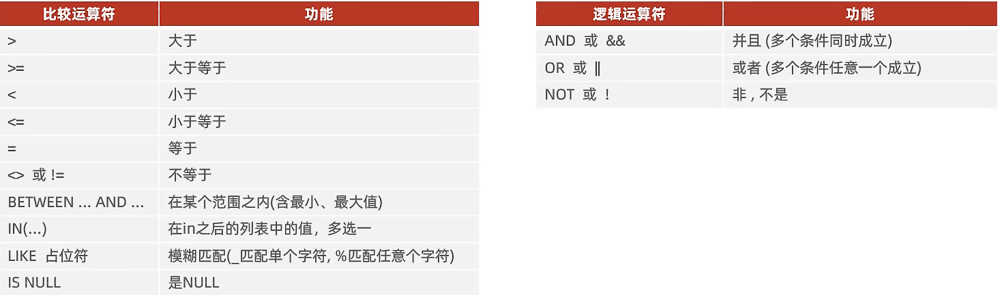

#### 聚合查询

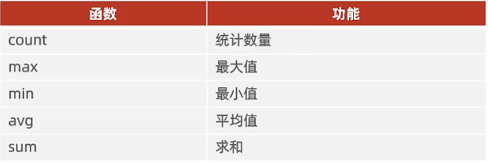

将一列数据作为一个整体进行纵向的计算。

`SELECT 聚合函数(字段列表) FROM 表名;`

NULL值不参与所有聚合函数运算

#### 分组查询

`SELECT 字段列表 FROM 表名 [WHERE条件] GROUP BY 分组字段名 [HAVING 分组后过滤条件];`

where与having区别

执行时机不同: where是分组之前进行过滤，不满足where条件，不参与分组;而having是分组之后对结果进行过滤。

判断条件不同: where不能对聚合函数进行判断，而having可以。

注意：

执行顺序: where >聚合函数>having

分组之后，查询的字段一般为聚合函数和分组字段，查询其他字段无任何意义。

#### 排序查询

`SELECT 字段列表 FROM 表名 ORDER BY 字段1 排序方式1, 字段2 排序方式2;`

排序方式：

ASC 升序（默认值）

DESC 降序

当有多个字段的时候，先按照前面的字段排序，如果前面的字段相同，再按照后面的字段排序

#### 分页查询

`SELECT 字段列表 FROM 表名 LIMIT 起始索引, 查询记录数;`

注意MySQL的起始索引从0开始

注意
·起始索引从o开始，起始索引=(查询页码-1)*每页显示记录数。
·分页查询是数据库的方言，不同的数据库有不同的实现，MySQL中是LIMIT。
·如果查询的是第一页数据，起始索引可以省略，直接简写为limit 10。

#### DQL的执行顺序

```sql
FROM
表名列表
WHERE
条件列表
GROUP BY
分组字段列表
HAVING
分组后条件列表
SELECT
字段列表
ORDER BY
排序字段列表
LIMIT
分页参数
```

### DCL

#### 用户相关操作

1．查询用户

```sql
USE mysql;
SELECT * FROM user;
```

在MySQL数据库中和用户相关的信息都存储在mysql数据库的user表中

2．创建用户

```sql
CREATE USER '用户名'@'主机名' IDENTIFIED BY '密码';
```

Host主机指定了允许用户登录所使用的IP，比如user=root Host=localhost。这里的意思就是说root用户只能通过localhost的客户端去访问。 

而%是个通配符，如果Host=10.215.6.%，那么就表示只要是IP地址前缀为“10.215.6.”的客户端都可以连接。如果Host=%，表示所有IP都有连接权限。

3．修改用户密码

```sql
ALTER USER '用户名'@'主机名' IDENTIFIED WITH mysql_native_password BY '新密码';
```

4．删除用户

```sql
DROP USER '用户名'@'主机名';
```

#### 权限相关操作

MySQL中的常用权限如下：


1．查询权限

```sql
SHOW GRANTS FOR‘用户名'@'主机名';
```

2.授予权限

```sql
GRANT 权限列表 ON 数据库名.表名 TO '用户名'@'主机名';
# 如果要授予该表的全部权限，授权列表可以填写关键字 ALL 
```

3．撤销权限

```sql
REVOKE 权限列表 ON 数据库名.表名 FROM '用户名'@'主机名';
```

注意:
·多个权限之间，使用逗号分隔
·授权时，数据库名和表名可以使用*进行通配，代表所有。

## MySQL内置函数

### 字符串函数

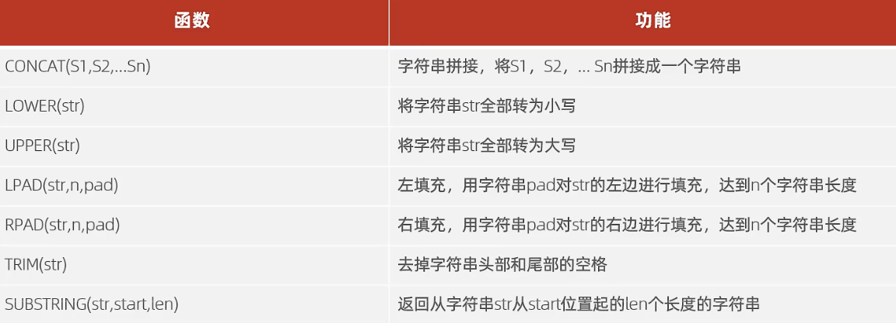

### 数值函数


### 日期函数

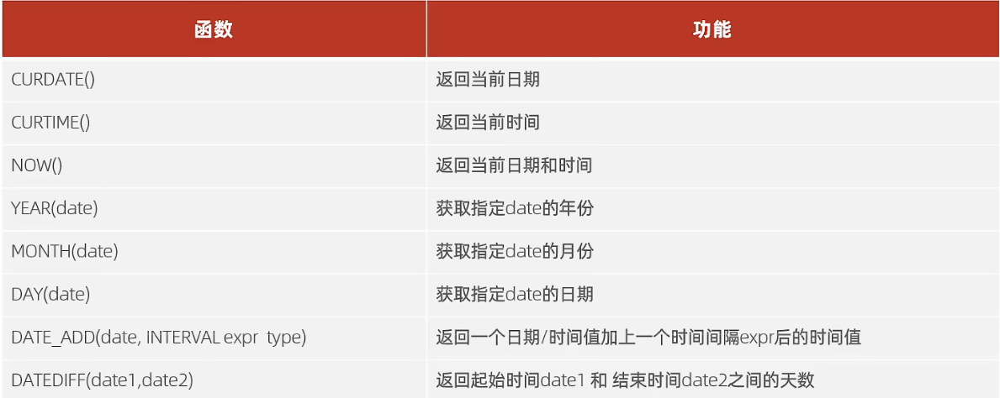

### 流程控制函数

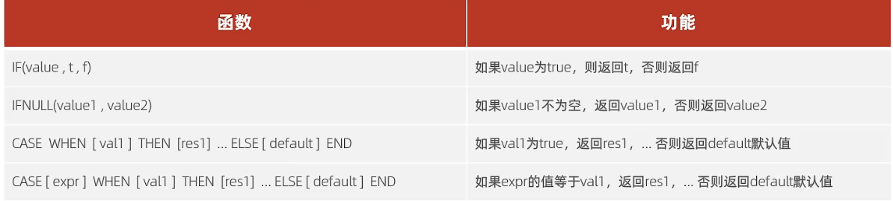

## 约束

概念:约束是作用于表中字段上的规则，用于限制存储在表中的数据。

常见约束

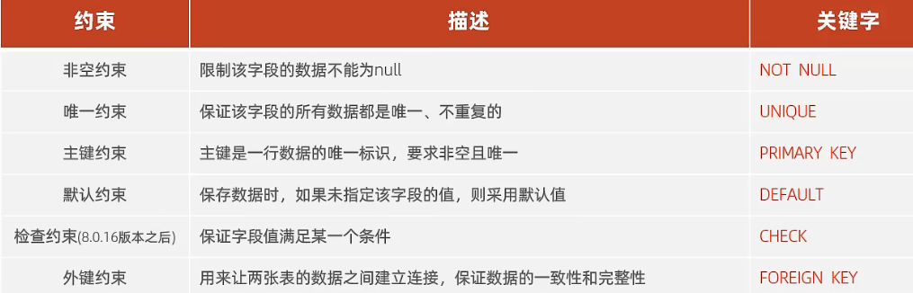

在定义表结构时，将约束关键字添加到对应的字段后就可以了，如果有多个约束，中间用空格隔开。

### 外键约束

外键用来让两张表的数据之间建立连接，从而保证数据的一致性和完整性。

添加外键的语法

```sql
-- 在建表的时候添加
CREATE TABLE表名(
字段名数据类型,…
[CONSTRAINT][外键名称]FOREIGN KEY(外键字段名) REFERENCES主表(主表列名)
);
-- 额外添加
ALTER TABLE 表名 ADD CONSTRAINT 外键名称 FOREIGN KEY (外键字段名) REFERENCES主表(主表列名);
```

删除外键

```sql
ALTER TABLE 表名 DROP FOREIGN KEY 外键名称;
```

### 外键的删除更新行为

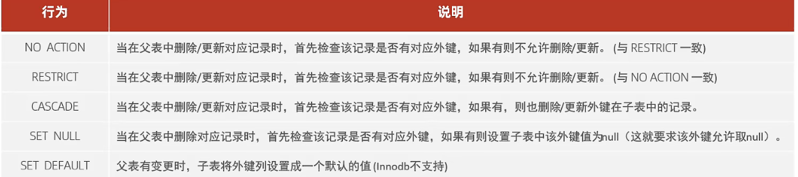

设置语法

```sql
ALTER TABLE 表名 ADD CONSTRAINT 外键名称 FOREIGN KEY (外键字段) REFERENCES 主表名 (主表字段名)
-- 在更新时 在删除时
ON UPDATE CASCADE ON DELETE CASCADE;
```

## 多表查询

### 多表关系

#### 一对多

案例:部门与员工的关系
关系:一个部门对应多个员工，一个员工对应一个部门
实现:在多的一方建立外键，指向一的一方的主键

#### 多对多

案例:学生与课程的关系
关系:一个学生可以选修多门课程，一门课程也可以供多个学生选择
实现:建立第三张中间表，中间表至少包含两个外键，分别关联两方主键

#### 一对一

案例:用户与用户详情的关系
关系:一对一关系，多用于单表拆分，将一张表的基础字段放在一张表中，其他详情字段放在另一张表中，以提升操作效率
实现:在任意一方加入外键，关联另外一方的主键，并且设置外键为唯一的(UNIQUE)

### 多表查询分类

#### 连接查询

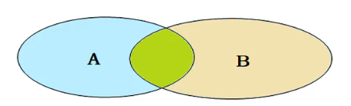

##### 内连接

相当于查询A、B交集部分数据

隐式内连接

```sql
SELECT 字段列表 FROM 表1,表2 WHERE 条件...;
```

显示内连接

```sql
SELECT 字段列表 FROM 表1 [INNER] JOIN 表2 ON 连接条件...;
```

##### 外连接

左外连接:查询左表所有数据，以及两张表交集部分数据

```sql
SELECT 字段列表 FROM 表1 LEFT [OUTER] JOIN 表2 ON 条件...;
```

右外连接:查询右表所有数据，以及两张表交集部分数据

```sql
SELECT 字段列表 FROM 表1 RIGHT [OUTER] JOIN 表2 ON 条件....;
```

##### 自连接

当前表与自身的连接查询，自连接必须使用表别名，自连接可以用内连接也可以是外连接

```sql
SELECT 字段列表 FROM 表A 别名A JOIN 表A 别名B ON 条件...;
```

#### 联合查询

对于union查询，就是把多次查询的结果合并起来，形成一个新的查询结果集。

```sql
SELECT 字段列表 FROM 表A ...
UNION [ALL]
SELECT 字段列表 FROM 表B.....;
```

不写`ALL`可以将查询结果去重

对于联合查询的多张表的列数必须保持一致，字段类型也需要保持一致。

#### 子查询

SQL语句中嵌套SELECT语句，称为嵌套查询，又称子查询。子查询外部的语句可以是INSERT /UPDATE/DELETE/ SELECT的任何一个。根据子查询位置，分为:WHERE之后、FROM之后、SELECT之后。

根据查询结果可以分为

+ 标量子查询(子查询结果为单个值)

+ 列子查询(子查询结果为一列)
  
  

+ 行子查询(子查询结果为一行)
  
  举例
  
  ```sql
  select * from emp where 
  (salary ,managerid) = (select salary，managerid from emp where name = '张无忌');
  ```
  
  常用的操作符:= 、> 、IN 、NOT IN

+ 表子查询(子查询结果为多行多列)
  
  常用操作符：IN
  
  表子查询通常在`FROM`后作为一个临时表进行多表查询

## 事务

### 事务简介

事务是一组操作的集合，它是一个不可分割的工作单位，事务会把所有的操作作为一个整体一起向系统提交或撤销操作请求，即这些操作要么同时成功，要么同时失败。

### 事务操作

查看设置事务提交方式

```sql
SELECT @@autocommit;
SET @@autocommit = 0;
```

#### @@autocommit

事务自动提交设置，默认为1，即除非显示声明一个事务的开始，否则每一个查询都会被当做独立的事务被处理

默认情况下，数据库处于自动提交模式。每一条语句处于一个单独的事务中，在这条语句执行完毕时，如果执行成功则隐式的提交事务，如果执行失败则隐式的回滚事务

关闭自动提交的原因，事务作为一个独立处理最小单元，往往需要处理一系列连续的数据操作，这些操作被视为一个整体，需要同时成功或同时失败，而不能其中某个操作成功；比如：A汇款给B，B接收到歀；即 A的账户扣款，而B的账户增加；必须同时成功或同时失败；如果成功则commit否则整体回滚；批量数据提交，如果提交1000条数据操作，需要处理1000次提交commit，而如果关闭autocommit等1000条数据处理完毕后统一一次提交

存储引擎需支持事务，如InnoDB，而MyISAM不支持事务

事务是否开启：如果没有显示的开启事务，autocommit 才会生效；
MySQL使用事务的两种方式

1、用 BEGIN, ROLLBACK, COMMIT来实现

- **START TRANSACTION或 BEGIN ;** 开始一个事务
- **ROLLBACK** 事务回滚
- **COMMIT** 事务确认

2、直接用 SET 来改变 MySQL 的自动提交模式:

- **SET AUTOCOMMIT=0** 禁止自动提交
- **SET AUTOCOMMIT=1** 开启自动提交
- **ROLLBACK** 事务回滚
- **COMMIT** 事务确认

#### 事务的四大特性（ACID）

原子性(Atomicity):事务是不可分割的最小操作单元，要么全部成功，要么全部失败。

一致性（Consistency) ︰事务完成时，必须使所有的数据都保持一致状态。在事务开始之前和事务结束以后，数据库的完整性没有被破坏。这表示写入的资料必须完全符合所有的预设规则，这包含资料的精确度、串联性以及后续数据库可以自发性地完成预定的工作。

隔离性（Ilsolation)∶数据库系统提供的隔离机制，保证事务在不受外部并发操作影响的独立环境下运行。数据库允许多个并发事务同时对其数据进行读写和修改的能力，隔离性可以防止多个事务并发执行时由于交叉执行而导致数据的不一致。事务隔离分为不同级别，包括读未提交（Read uncommitted）、读提交（read committed）、可重复读（repeatable read）和串行化（Serializable）。

持久性（Durability):事务一旦提交或回滚，它对数据库中的数据的改变就是永久的。即便系统故障也不会丢失。

#### 并发事务

##### 并发事务中会有的问题


举例：

　**1、脏读：事务A读取了事务B更新的数据，然后B回滚操作，那么A读取到的数据是脏数据**

　**2、不可重复读：事务 A 多次读取同一数据，事务 B 在事务A多次读取的过程中，对数据作了更新并提交，导致事务A多次读取同一数据时，结果 不一致。**

　**3、幻读：系统管理员A将数据库中所有学生的成绩从具体分数改为ABCDE等级，但是系统管理员B就在这个时候插入了一条具体分数的记录，当系统管理员A改结束后发现还有一条记录没有改过来，就好像发生了幻觉一样，这就叫幻读。**

**不可重复读的和幻读很容易混淆，不可重复读侧重于修改，幻读侧重于新增或删除。解决不可重复读的问题只需锁住满足条件的行，解决幻读需要锁表**

##### 事务隔离级别


读未提交（Read uncommitted）

读提交（read committed）

**写数据只会锁住相应的行**

可重复读（repeatable read）

**如果检索条件有索引（包括主键索引）的时候，默认加锁方式是next-key 锁；如果检索条件没有索引，更新数据时会锁住整张表。一个间隙被事务加了锁，其他事务是不能在这个间隙插入记录的，这样可以防止幻读。**

串行化（Serializable）

**事务隔离级别为串行化时，读写数据都会锁住整张表**

查看设置事务的隔离级别

```sql
--查看事务隔离级别
SELECT @@TRANSACTION_ISOLATION;
--设置事务隔离级别
SET [SESSION|GLOBAL] --【当前会话|全局】
TRANSACTION ISOLATION LEVEL 
[READ UNCOMMITTED|READ COMMITTED|REPEATABLE READ|SERIALIZABLE]
```

## MySQL体系结构图

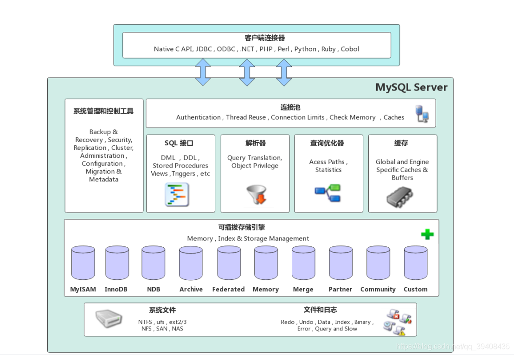

连接层
最上层是一些客户端和链接服务，主要完成一些类似于连接处理、授权认证、及相关的安全方案。服务器也会为安全接入的每个客户端验证它所具有的操作权限。

服务层
第二层架构主要完成大多数的核心服务功能，如SQL接口，并完成缓存的查询，SQL的分析和优化，部分内置函数的执行。所有跨存储引擎的功能也在这一层实现，如过程、函数等。

引擎层
存储引擎真正的负责了MySQL中数据的存储和提取，服务器通过API和存储引擎进行通信。不同的存储引擎具有不同的功能，这样我们可以根据自己的需要,来选取合适的存储引擎。

存储层
主要是将数据存储在文件系统之上,并完成与存储引擎的交互。

## 存储引擎

存储引擎就是存储数据、建立索引、更新/查询数据等技术的实现方式。存储引擎是基于表的，而不是基于库的所以存储引擎也可被称为表类型。

创建表时可以指定存储引擎

```sql
CREATE TABLE表名(
字段1 字段1类型 [COMMENT 字段1注释],
...
字段n 字段n类型 [COMMENT字段n注释]
)ENGINE = INNODB [COMMENT 表注释];
```

查询当前数据库支持的存储引擎

```sql
SHOW ENGINES;
```

示例，在MySQL8.0.22中支持的存储引擎

| Engine              | Support | Comment                                                           | Transactions | XA   | Savepoints |
|:------------------- |:------- |:----------------------------------------------------------------- |:------------ |:---- |:---------- |
| MEMORY              | YES     | Hash based, stored in memory, useful for temporary tables（存储在内存中） | NO           | NO   | NO         |
| MRG\_MYISAM         | YES     | Collection of identical MyISAM tables                             | NO           | NO   | NO         |
| CSV                 | YES     | CSV storage engine                                                | NO           | NO   | NO         |
| FEDERATED           | NO      | Federated MySQL storage engine                                    | NULL         | NULL | NULL       |
| PERFORMANCE\_SCHEMA | YES     | Performance Schema                                                | NO           | NO   | NO         |
| MyISAM              | YES     | MyISAM storage engine（MySQL早期版本默认使用）                              | NO           | NO   | NO         |
| InnoDB              | DEFAULT | Supports transactions, row-level locking, and foreign keys        | YES          | YES  | YES        |
| BLACKHOLE           | YES     | /dev/null storage engine \(anything you write to it disappears\)  | NO           | NO   | NO         |
| ARCHIVE             | YES     | Archive storage engine                                            | NO           | NO   | NO         |

### InnoDB存储引擎

InnoDB是一种兼顾高可靠性和高性能的通用存储引擎，在MySQL5.5之后，InnoDB是默认的MySQL存储引擎。

**特点**

DML操作遵循ACID模型，支持事务;

行级锁，提高并发访问性能;

支持外键FOREIGN KEY约束，保证数据的完整性和正确性;

**文件（物理存储结构）**

xx.ibd; xx代表的是表名,innoDB引擎的每张表都会对应这样一个表空间文件，存储该表的表结构（frm、sdi)、数据和索引。参数: innodb_file_per_table

`show variables like 'innodb_file_per_table' ;`

如果这个开关打开则说明每一张表对应一个物理文件。

**逻辑存储结构**

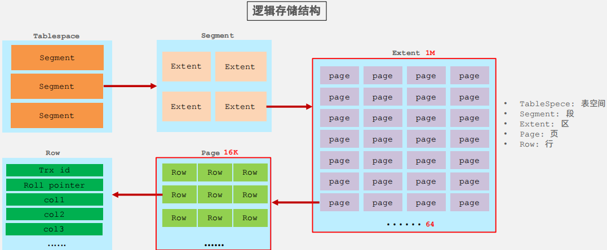

### MyISAM存储引擎

MyISAM是MySQL早期的默认存储引擎

**特点**

不支持事务，不支持外键

支持表锁，不支持行锁

访问速度快

**文件（物理结构）**

xxx.sdi：存储表结构信息

xxx.MYD: 存储数据

xxx.MYI: 存储索引

### Memory存储引擎

Memory引擎的表数据时存储在内存中的，由于受到硬件问题、或断电问题的影响，只能将这些表作为临时表或缓存使用。

**特点**

内存存放

hash索引（默认）

**文件**

xxx.sdi：存储表结构信息

### 三个常用存储引擎的对比

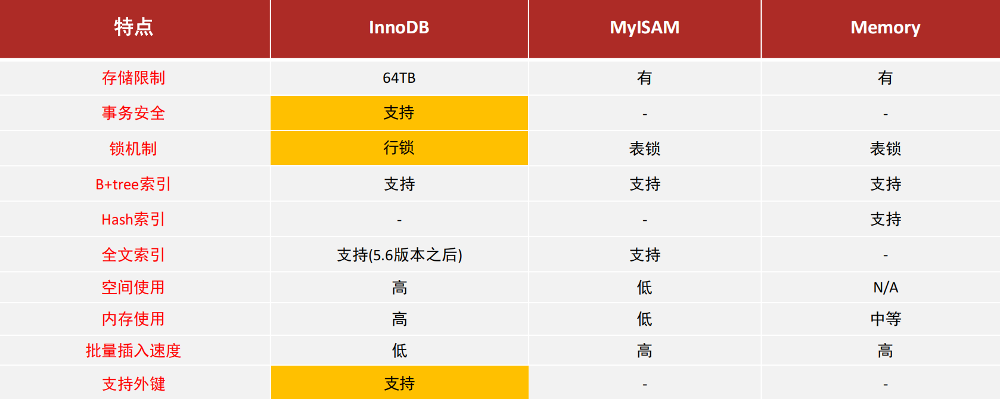

### 存储引擎选择

在选择存储引擎时，应该根据应用系统的特点选择合适的存储引擎。对于复杂的应用系统，还可以根据实际情况选择多种存储引擎进行组

合。

➢ InnoDB : 是Mysql的默认存储引擎，支持事务、外键。如果应用对事务的完整性有比较高的要求，在并发条件下要求数据的一致

性，数据操作除了插入和查询之外，还包含很多的更新、删除操作，那么InnoDB存储引擎是比较合适的选择。

➢ MyISAM ： 如果应用是以读操作和插入操作为主，只有很少的更新和删除操作，并且对事务的完整性、并发性要求不是很高，那

么选择这个存储引擎是非常合适的。

➢ MEMORY：将所有数据保存在内存中，访问速度快，通常用于临时表及缓存。MEMORY的缺陷就是对表的大小有限制，太大的表

无法缓存在内存中，而且无法保障数据的安全性。

## 索引

索引（index）是帮助MySQL高效获取数据的数据结构（有序）。在数据之外，数据库系统还维护着满足特定查找算法的数据结构，这些

数据结构以某种方式引用（指向）数据， 这样就可以在这些数据结构上实现高级查找算法，这种数据结构就是索引。

当没有索引时查询会进行全表扫描。


### 索引的结构


### B树

多路平衡查找树，多路是每个节点可以有多个子节点。以一颗最大度数（max-degree）为5(5阶)的b-tree为例(每个节点最多存储4个key，5个指针)：

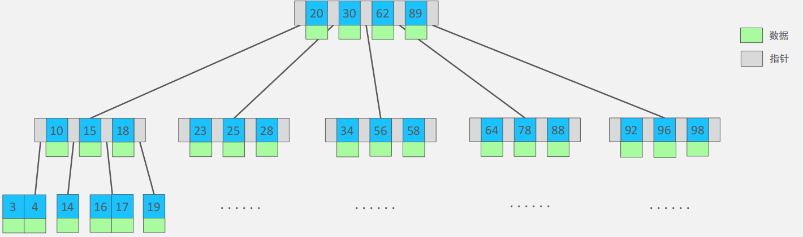

### B+树

相对于B-Tree区别:

①. 所有的数据都会出现在叶子节点

②. 叶子节点形成一个单向链表

MySQL索引数据结构对经典的B+Tree进行了优化。在原B+Tree的基础上，增加一个指向相邻叶子节点的链表指针，就形成了带有顺

序指针的B+Tree，提高区间访问的性能。

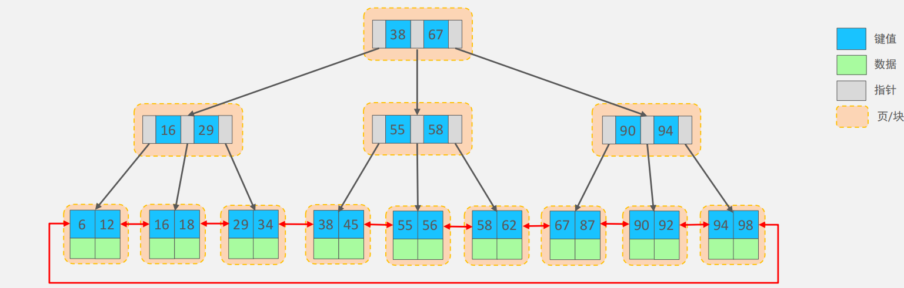

### Hash

哈希索引就是采用一定的hash算法，将键值换算成新的hash值，映射到对应的槽位上，然后存储在hash表中。如果两个(或多个)键值，映射到一个相同的槽位上，他们就产生了hash冲突（也称为hash碰撞），可以通过链表来解决。

Hash索引特点

1.Hash索引只能用于对等比较(=，in)，不支持范围查询（between，>，< ，...）

2.无法利用索引完成排序操作

3.查询效率高，通常只需要一次检索就可以了，效率通常要高于B+tree索引

在MySQL中，支持hash索引的是Memory引擎，而InnoDB中具有自适应hash功能，hash索引是存储引擎根据B+Tree索引在指定条件下自动构建的

### 为什么InnoDB存储引擎选择使用B+tree索引结构?

➢ 相对于二叉树，层级更少，搜索效率高；

➢ 对于B-tree，无论是叶子节点还是非叶子节点，都会保存数据，这样导致一

页中存储的键值减少，指针跟着减少，要同样保存大量数据，只能增加树的

高度，导致性能降低；

➢ 相对Hash索引，B+tree支持范围匹配及排序操作；

### 索引的分类


如果根据存储方式分，索引还可以分为以下两种（InnoDB引擎）


聚集索引选取规则:

➢ 如果存在主键，主键索引就是聚集索引。

➢ 如果不存在主键，将使用第一个唯一（UNIQUE）索引作为聚集索引。

➢ 如果表没有主键，或没有合适的唯一索引，则InnoDB会自动生成一个rowid作为隐藏的聚集索引。

通过二级索引查询到主键值后，还需要根据聚集索引查询到该行数据的具体信息，这叫回表查询

### 索引语法

创建索引

```sql
CREATE [UNIQUE|FULLTEXT] INDEX index_name ON table_name ( index_col_name...) ;
```

查看索引

```sql
SHOW INDEX FROM table_name ;
```

删除索引

```sql
DROP INDEX index_name ON table_name ;
```

### SQL性能分析

#### SQL执行频率

MySQL 客户端连接成功后，通过 show [session|global] status 命令可以提供服务器状态信息。通过如下指令，可以查看当前数据库

的INSERT、UPDATE、DELETE、SELECT的访问频次

```sql
SHOW GLOBAL STATUS LIKE 'Com_______';   --Com后七个下划线
```

#### 慢查询日志

慢查询日志记录了所有执行时间超过指定参数（long_query_time，单位：秒，默认10秒）-的所有SQL语句的日志。

查看慢查询日志开启状态（默认是不开启的）

```sql
show variables like 'slow_query_log' ;
```

方法一：全局变量设置(该方式数据库重启全部失效，得重新配置)

将 slow_query_log 全局变量设置为“ON”状态

```sql
set global slow_query_log = 'ON';
```

设置慢查询日志存放的位置

```sql
set global slow_query_log_file='/usr/local/mysql/data/slow.log'; //linux
set global slow_query_log_file='D:\\mysq\data\slow.log';         //windows
```

设置查询超过1秒就记录（如果有时候用命令不起作用，那么可以关闭再打开）

```sql
set global long_query_time=1;
```

方法二：配置文件设置（服务器重启不影响）

修改配置文件my.cnf，在[mysqld]下的下方加入

```sql
[mysqld]
slow_query_log = ON
slow_query_log_file = /usr/local/mysql/data/slow.log     //linux
long_query_time = 2
#开启MySQL慢日志查询开关 slow_query_log=1
#设置慢日志的时间为2秒，SQL语句执行时间超过2秒，就会视为慢查询，记录慢查询日志 long_query_time=2
```

重启MySQL服务

```sql
service mysqld restart;
```

#### Profile详情

show profiles 能够在做SQL优化时帮助我们了解时间都耗费到哪里去了。通过have_profiling参数，能够看到当前MySQL是否支持

profile操作：

```sql
SELECT @@have_profiling; --查看当前版本是否支持profile
```

默认profiling是关闭的，可以通过set语句在session/global级别开启profiling：

```sql
SELECT @@profiling; --查看profile是否开启
SET profiling = 1; --开启profile
```

#### Explain执行计划

EXPLAIN 或者 DESC命令获取 MySQL 如何执行 SELECT 语句的信息，包括在 SELECT 语句执行过程中表如何连接和连接的顺序。

语法：

```sql
#直接在select语句之前加上关键字explain/desc
EXPLAIN SELECT 字段列表 FROM 表名 WHERE 条件;
```

EXPLAIN 执行计划各字段含义：

➢Id

select查询的序列号，表示查询中执行select子句或者是操作表的顺序(id相同，执行顺序从上到下；id不同，值越大，越先执行)。

➢select_type

表示 SELECT 的类型，常见的取值有 SIMPLE（简单表，即不使用表连接或者子查询）、PRIMARY（主查询，即外层的查询）、

UNION（UNION 中的第二个或者后面的查询语句）、SUBQUERY（SELECT/WHERE之后包含了子查询）等

➢ type

表示连接类型，性能由好到差的连接类型为NULL、system、const、eq_ref、ref、range、 index、all 。

➢possible_key

显示可能应用在这张表上的索引，一个或多个。

➢Key

实际使用的索引，如果为NULL，则没有使用索引。

➢Key_len

表示索引中使用的字节数， 该值为索引字段最大可能长度，并非实际使用长度，在不损失精确性的前提下， 长度越短越好 。

➢rows

MySQL认为必须要执行查询的行数，在innodb引擎的表中，是一个估计值，可能并不总是准确的。

➢ filtered

表示返回结果的行数占需读取行数的百分比， filtered 的值越大越好。

### 最左前缀法则

如果索引了多列（联合索引），要遵守最左前缀法则。最左前缀法则指的是查询从索引的最左列开始，并且不跳过索引中的列。

+ 如果跳跃某一列，索引将部分失效(后面的字段索引失效)。

+ 联合索引中，出现范围查询(>,<)，范围查询右侧的列索引失效

### 索引失效的情况

1.索引列运算

不要在索引列上进行运算操作， 索引将失效。

```sql
explain select * from tb_user where substring(phone,10,2) = '15';
```

2.字符串不加引号

字符串类型字段使用时，不加引号， 索引将失效。

3.模糊查询

如果仅仅是尾部模糊匹配，索引不会失效。如果是头部模糊匹配，索引失效。

```sql
explain select * from tb_user where profession like '软件%'; --索引有效
explain select * from tb_user where profession like '%工程'; --头部模糊匹配索引失效
explain select * from tb_user where profession like '%工%';  --头部模糊匹配索引失效
```

4.or连接的条件

用or分割开的条件， 如果or前的条件中的列有索引，而后面的列中没有索引，那么涉及的索引都不会被用到。

5.数据分布影响

如果MySQL评估使用索引比全表更慢，则不使用索引。

### SQL提示（告知MySQL，索引的使用方式）

使用索引(只是建议MySQL使用，MySQL可以不接受)

```sql
explain select * from tb_user 
use index(idx_user_pro) 
where profession= '软件工程';
```

忽略索引

```sql
explain select * from tb_user 
ignore index(idx_user_pro) 
where profession="软件工程";
```

强迫使用某个索引

```sql
explain select * from tb_user 
force index(idx_user_pro) 
where profession= '软件工程';
```

### 覆盖索引

尽量使用覆盖索引（查询使用了索引，并且需要返回的列，在该索引中已经全部能够找到），减少使用`SELECT *`

覆盖索引可以做到减少回表查询。使用`SELECT *` 可能会导致回表查询的产生，降低SQL性能。

> 回表查询
> 
> 在InnoDB中有聚集索引和二级索引（见上文）。聚集索引中存储的是行数据，而二级索引中存储的是行数据的主键，如果走了二级索引，并且还需要取得索引外字段的值，就需要通过二级索引中存储的主键值，到聚集索引中进行查询，这一过程被称为回表查询，会减慢SQL的执行效率。

在Explain工具的Extra字段中

using index condition ：查找使用了索引，但是需要回表查询数据

using where; using index ：查找使用了索引，但是需要的数据都在索引列中能找到，所以不需要回表查询数据

## MySQL查询修改系统变量的值

### 查看所有全局变量的值

```sql
SHOW GLOBAL VARIABLES
# 或者
SHOW VARIABLES
```

mysql有很多全局变量，包括系统的一些基本信息，以及mysql的一些基本配置都可以在全局变量中查到。

### 查看单个全局变量的值

```sql
SHOW GLOBAL VARIABLES LIKE 'wait_timeout'
```

上面的查询也可以用模糊查询，与上面结果一样的模糊查询语句

```sql
SHOW GLOBAL VARIABLES LIKE 'wait_time%'

SHOW GLOBAL VARIABLES LIKE '%wait%'
```

注意:查看mysql的全局变量也可以不加global关键字，例如

```sql
SHOW VARIABLES

SHOW VARIABLES LIKE '%wait%'

SHOW VARIABLES LIKE 'wait_timeout'

SHOW VARIABLES LIKE '%wait%'
```

### 设置全局变量的值

```sql
SET GLOBAL wait_timeout = 604800;

SET @@GLOBAL.wait_timeout = 604800

SET GLOBAL event_scheduler = ON;

SET @@global.event_scheduler = ON;

SET GLOBAL event_scheduler = 1;

SET @@global.event_scheduler = 1;
```

## SQL优化

### Insert优化

1.采用批量插入的方式，但是一次插入最好不超过一千条

```sql
insert into tb_test values(1 , 'Tom'),(2,'Cat'),(3,'Jerry');
```

2.将事务的提交方式改为手动提交

```sql
start transaction;
insert into tb_test values(1,'Tom'),(2,'Cat'),(3,'Jerry');
insert into tb_test values(4,'Tom'),(5,'Cat'),(6,'Jerry');
insert into tb_test values(7,'Tom'),(8,'Cat'),(9,'Jerry');
commit;
```

3.在插入时，主键按顺序插入。

4.如果数据存储在本地，还可以使用MySQL提供的Load指令将本地数据一次性导入进数据库。

本地文件：

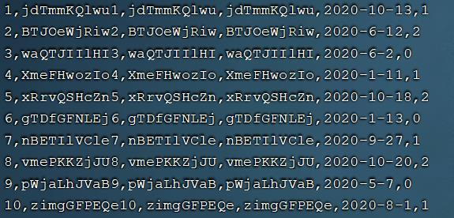

操作语句：

```sql
#客户端连接服务端时，加上参数--local-infile
mysql --local-infile -u root -p
#设置全局参数local_infile为1，开启从本地加载文件导入数据的开关
set global local_infile= 1;
#执行load指令将准备好的数据，加载到表结构中
load data local infile '/root/sql1.log into table' `tb_user` fields terminated by ',' lines terminated by '\n';
```

### 主键优化

➢满足业务需求的情况下，尽量降低主键的长度。

因为二级索引的叶子节点中存储的是主键，如果主键长度过大会导致二级节点占据的空间过大

➢插入数据时，尽量选择顺序插入，选择使用AUTO_INCREMENT自增主键。

乱序插入可能会导致页分裂


➢尽量不要使用UUID做主键或者是其他自然主键，如身份证号。

UUID或者其他自然主键一是长度过长，二是他们一般是乱序的，会导致也分裂降低插入效率

➢业务操作时，避免对主键的修改。

### Order By优化

使用Order By后MySQL的排序有以下两种方式。

1.Using filesort :通过表的索引或全表扫描，读取满足条件的数据行，然后在排序缓冲区sort buffer中完成排序操作，所有不是通过索引直接返回排序结果的排序都叫FileSort排序。
2.Using index :通过有序索引顺序扫描直接返回有序数据，这种情况即为using index，不需要额外排序，操作效率高。

```sql
#创建索引时指定某个字段是升序还是降序
create index idx_user_age_phone_ad on tb_user(age asc ,phone desc);
```

优化规则如下：

➢ 根据排序字段建立合适的索引，多字段排序时，也遵循最左前缀法则。（此时的最左匹配原则和顺序相关）

➢ 尽量使用覆盖索引。

➢ 多字段排序 一个升序一个降序，此时需要注意联合索引在创建时的规则（ASC/DESC）

➢ 如果不可避免的出现filesort，大数据量排序时，可以适当增大排序缓冲区大小sort_buffer_size(默认256K)

注意：如果sort buffer缓冲区已满，MySQL会使用外存进行排序

## 锁

MySQL中锁按照粒度分为以下几个级别：

+ 全局锁：锁定数据库中所有的表

+ 表级锁：锁定整张表

+ 行级锁：每次操作锁定住对应的行数据

### 全局锁

全局锁就是对整个数据库实例进行加锁，加锁后整个数据库实例就处于只读状态。

最典型的使用场景就是做全库的逻辑备份。

### 表级锁

表级锁，每次操作锁住整张表。锁定粒度大，发生锁冲突的概率最高，并发度最低。应用在MyISAM、InnDB、BDB等存储引擎中。

对于表级锁分为以下三类：

+ 表锁

+ 元数据锁（mate data lock， MDL）

+ 意向锁

#### 表锁

表锁分为以下两类：表共享读锁（读锁），表独占写锁（写锁）

语法：

```sql
# 加锁
LOCK TABLES 表名... READ/WRITE;
# 释放锁
UNLOCK TABLES;
```

**读锁**

一个Session如果加了读锁，那么当前Session和其他Session都只能对被加锁表进行读操作。

**写锁**

一个Session如果加了写锁，那么其他Session既不能对被加锁表进行读取也不能进行修改，而持有锁的Session既可以读也可以写。

#### 元数据锁

元数据锁中的元数据指的就是一张表的表结构。元数据锁的加锁过程是系统自动控制的，无需显示的使用，其主要作用是维护表的元数据的数据一致性，在表上有活动的事务时，不可以对元数据进行修改。**简单的说就是，在表上有未提交事务时，不能修改表结构。**

元数据锁（MDL）在MySQL5.5中引入，当对一张表进行增删改查的时候，加MDL读锁；当对表结构进行修改时，加MDL写锁。

一些常见的SQL和MDL锁的对应关系如下：

| 对应SQL                                      | 对应元数据锁类型                                | 说明                                       |
| ------------------------------------------ | --------------------------------------- | ---------------------------------------- |
| LOCK TABLES  表名... READ/WRITE              | SHARED_READ_ONLY / SHARED_NO_READ_WRITE |                                          |
| SELECT、 SELECT ...  LOCK IN SHARE MODE     | SHARED_READ                             | 与SHARED_READ、SHARED_WRITE兼容，与EXCLUSIVE互斥 |
| INSERT、UPDATE、DELETE、SELECT ... FOR UPDATE | SHARED_WRITE                            | 与SHARED_READ、SHARED_WRITE兼容，与EXCLUSIVE互斥 |
| ALTER TABLE ...                            | EXCLUSIVE                               | 与其他元数据锁都互斥                               |

#### 意向锁

在对一个表添加表锁时，需要确定表中有哪些行锁，为了方便判断，故在加行锁时，会给表加上一个表级的锁，意向锁。

意向锁分为以下两类：

+ 意向共享锁（IS）：由语句SELCET ... LOCK IN SHARE MODE添加

+ 意向排他锁（IX）：由INSERT、UPDATE、DELETE、SELECT ... FOR UPDATE添加

意向共享锁与表锁中的读锁兼容，意向排他锁与表锁中的读锁和写锁都互斥。意向锁之间不会互斥。

### 行级锁

行级锁，每次操作锁住对应的行数据。锁定粒度最小，发生锁冲突的概率最低，并发度最高。应用在InnoDB存储引擎中。

InnoDB的数据是基于索引组织的，行锁是通过对索引上的索引项加锁来实现的，而不是对记录加的锁。

对于行级锁，主要分为以下三类:

+ 行锁（Record Lock）：锁定单行记录，防止其他事务对此行数据进行update和delete，在`read commit` 和`reaptable read`的隔离级别下都支持。

+ 间隙锁（Gap Lock）：锁定索引记录间隙（不含该记录），确保索引记录不变，防止其他事务在这个间隙进行insert，从而产生幻读。在`reaptable read`隔离级别下支持。

+ 临键锁（Next-Key Lock）：行锁和间隙锁组合，同时锁住数据，并锁住数据前面间隙的Gap。在`reaptable read`隔离级别下支持。

#### 行锁

InnoDB实现了以下两种类型的行锁:
1.共享锁(S)∶允许一个事务去读一行，阻止其他事务获得相同数据集的排它锁。

2.排他锁(X)∶允许获取排他锁的事务更新数据，阻止其他事务获得相同数据集的共享锁和排他锁。

|     | 共享锁 | 排他锁 |
| --- | --- | --- |
| 共享锁 | 兼容  | 冲突  |
| 排他锁 | 冲突  | 冲突  |

**行锁类型**

| SQL                         | 类型      |
| --------------------------- | ------- |
| INSERT                      | 排他锁     |
| UPDATE                      | 排他锁     |
| DELETE                      | 排他锁     |
| SELECT                      | **不加锁** |
| SELECT... ... IN SHARE MODE | **共享锁** |
| SELECT... ... FOR UPDATE    | 排他锁     |

**行锁的实际运用**

1. 针对唯一索引进行检索时，InnoDB对已经存在记录进行等值匹配时，将会自动优化为行锁

2. InnoDB的行锁是基于索引的，对于不通过索引条件检索数据，InnoDB将会对表中所有记录加锁，此时就会升级成表锁。

#### 间隙锁与临键锁

默认情况下，InnoDB在REPEATABLE READ事务隔离级别运行，InnoDB使用next-key锁进行搜索和索引扫描，以防止幻读。

1.索引上的等值查询(唯一索引)，给不存在的记录加锁时,优化为间隙锁。

2.索引上的等值查询(普通索引)，向右遍历时最后一个值不满足查询需求时,next-key lock退化为间隙锁。

3索引上的范围查询(唯一索引)--会访问到不满足条件的第一个值为止。
