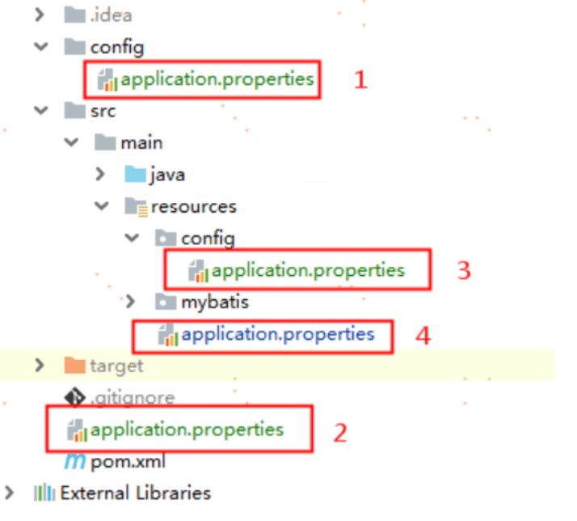

## 配置文件的种类

SpringBoot支持两种格式的配置文件分别是`properties`和`yml`。主流使用yml格式，即`application.yml`

另外，当application.properties和application.yml同时存在时，application.properties的优先级更高

## 配置文件优先级

### 官方文档

Config data files are considered in the following order:

1. [Application properties](https://docs.spring.io/spring-boot/docs/current/reference/html/features.html#features.external-config.files) packaged inside your jar ( and YAML variants).`application.properties`

2. [Profile-specific application properties](https://docs.spring.io/spring-boot/docs/current/reference/html/features.html#features.external-config.files.profile-specific) packaged inside your jar ( and YAML variants).`application-{profile}.properties`

3. [Application properties](https://docs.spring.io/spring-boot/docs/current/reference/html/features.html#features.external-config.files) outside of your packaged jar ( and YAML variants).`application.properties`

4. [Profile-specific application properties](https://docs.spring.io/spring-boot/docs/current/reference/html/features.html#features.external-config.files.profile-specific) outside of your packaged jar ( and YAML variants).`application-{profile}.properties`

> 1.打开SpringBoot官网[Spring Boot](https://spring.io/projects/spring-boot)
> 
> 2.选择一个版本的文档[Spring Boot Reference Documentation](https://docs.spring.io/spring-boot/docs/current/reference/html/)
> 
> 3.选择其中的Application Propertise链接[Common Application Properties (spring.io)](https://docs.spring.io/spring-boot/docs/current/reference/html/application-properties.html#appendix.application-properties)

## 补充

官方文档只写出了在jar包内的优先级比在jar包外的优先级搞，此外还有以下四种情况，其优先级依次降低：

1级： file ：config/application.yml（【最高】）（file目录就是jar包所在目录）

2级： file ：application.yml

3级：classpath：config/application.yml

4级：classpath：application.yml（【最低】）

作用：

 1级与2级留做系统打包后设置通用属性，1级常用于运维经理进行线上整体项目部署方案调控

 3级与4级用于系统开发阶段设置通用属性，3级常用于项目经理进行整体项目属性调控



## 多环境配置文件

### 单配置文件的多环境配置

```yml
spring:
 profiles:
# 设置使用哪个环境
  active: pro
# 不同环境之间用“---”隔开
--- 
spring:
# 给当前环境命名
 profiles: pro #过时格式
# 当前推荐格式
spring:
 config:
  activate:
   on-profile: pro
server:
 port: 80
---
spring:
profiles: dev
server:
port: 81
---
spring:
profiles: test
server:
port: 82
```

### 多配置文件的多环境配置

1.主启动配置文件application.yml

```yml
spring:
 profiles:
# 主文件仅需要指定使用哪个配置文件
  active: dev
```

2. 环境分类配置文件application-pro.yml

```yml
server:
 port: 80
```

3. 环境分类配置文件application-dev.yml

```yml
server:
 port: 81
```

4. 环境分类配置文件application-test.yml

```yml
server:
 port: 82
```

主配置文件中设置公共配置（全局）

环境分类配置文件中常用于设置冲突属性（局部）

另外如果使用properties，则只可以使用多文件配置多环境。

## 环境分组管理

根据功能对配置文件中的信息进行拆分，并制作成独立的配置文件，命名规则如下

 application-devDB.yml

 application-devRedis.yml

 application-devMVC.yml

使用include属性在激活指定环境的情况下，同时对多个环境进行加载使其生效，多个环境间使用逗号分隔

```yml
spring:
 profiles:
 active: dev
 include: devDB,devRedis,devMVC
```

> 当主环境dev与其他环境有相同属性时，主环境属性生效；其他环境中有相同属性时，最后加载的环境属性生效

或者使用group属性（SpringBoot2.4及以后版本）

```yml
spring:
 profiles:
 active: dev
 group:
  "dev": devDB,devRedis,devMVC
  "pro": proDB,proRedis,proMVC
  "test": testDB,testRedis,testMVC
```
