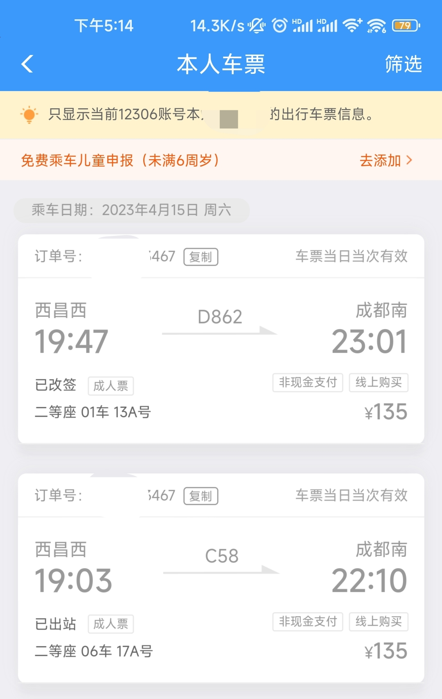
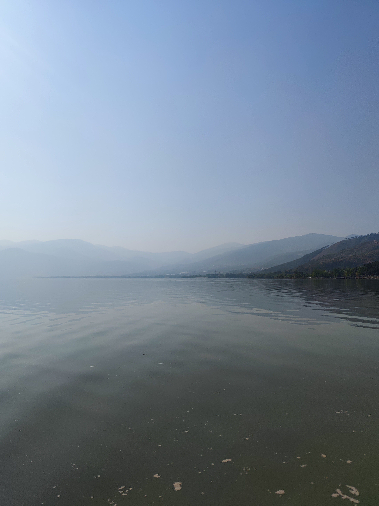

---

title: 西昌——离成都三小时车程的桃源之地
date: 2023-4-22 17:11:46
category:
- 生活笔记
tag:
- 西昌
- 四川

---

# 西昌——离成都三小时车程的桃源之地

## 缘由

女朋友要到西昌办些事情，我作为陪同，也有幸来到此。我们赶了几乎是成都到西昌最晚的一班列车，晚上七点钟从成都出发，半夜十点才到达西昌。这趟列车很有意思是刷绿的高铁，我还是第一次乘坐这种列车。不知是否是我的个人原因，在列车的一路上的，我的耳膜总是胀的微微有些疼痛。

## 初识西昌

这是我第二次到达一个少数民族自治地区，刚下火车的我依旧被满大街的彝族文字震撼到，异域风情的感觉令我对“月城”西昌流连忘返。我们从高铁站出来后，打了一辆黑车，前往下榻的酒店。整顿好后，我们在楼下品尝了一番西昌的烤串。不得不说，和成都昂贵又难吃的烧烤相比，西昌烧烤简直让我对四川烧烤又有了一个新的认识。量大而实惠，口感干香爽口。

## 邛海

女朋友需要办理事情，我这几天便独自在西昌自由活动起来。第一站便是邛海。

> 邛海是四川省第二大[淡水湖](https://baike.baidu.com/item/%E6%B7%A1%E6%B0%B4%E6%B9%96/619544?fromModule=lemma_inlink)，古称邛池，属更新世早期[断陷湖](https://baike.baidu.com/item/%E6%96%AD%E9%99%B7%E6%B9%96?fromModule=lemma_inlink)。其形状如蜗牛，南北长11.5公里，东西宽5.5公里，周长35公里，水域面积30平方公里左右；湖水平均深14米，最深处34米；水面标高为1507.14—1509.28米；水位变幅小，[集水面积](https://baike.baidu.com/item/%E9%9B%86%E6%B0%B4%E9%9D%A2%E7%A7%AF/221156?fromModule=lemma_inlink)约27平方公里。

邛海确实是大，大到根本看不见边际，我在岸边买了张船票，得以泛舟于湖上，近距离观察邛海。

泛舟之上，向远处眺望，天际线与湖水融为一体。对自然的敬畏油然而生，寄蜉蝣于天地，渺沧海之一粟！

# 泸山

与邛海仅挨着的便是泸山，值得一提的是，庐山上有特别多的野生猴子，作为游客还可以与它们近距离接触。

## 蓝花楹

四月的西昌，蓝花楹盛开，航天北路正是绝佳的打卡地点！

