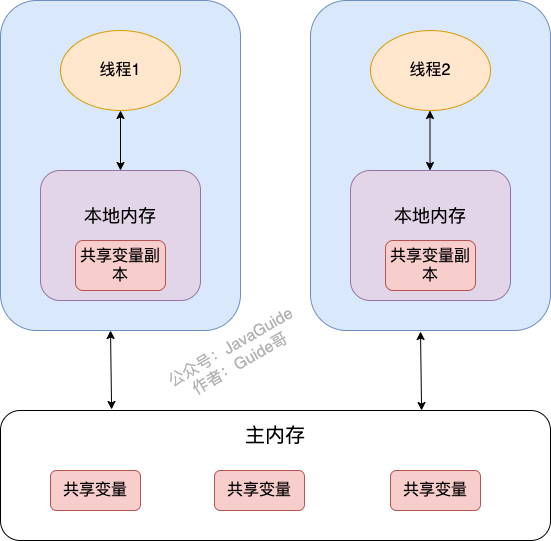

# JMM——Java内存模型

Java内存模型，JMM即 Java Memory Model，它定义了主存（所有线程都共享的数据）和工作内存（线程私有的数据）的抽象概念，底层对应着CPU寄存器、缓存、硬件内存、CPU指令优化等。JMM主要是为了屏蔽系统和硬件的差异。

JMM体现在以下几个方面

- 原子性-保证指令不会受到线程上下文切换的影响
- 可见性-保证指令不会受cpu缓存的影响
- 有序性-保证指令不会受cpu指令并行优化的影响

### 可见性

在 JDK1.2 之前，Java 的内存模型实现总是从**主存**（即共享内存）读取变量，是不需要进行特别的注意的。而在当前的 Java 内存模型下，线程可以把变量保存**工作内存（本地内存）** 比如机器的寄存器中，而不是直接在主存中进行读写。这就可能造成一个线程在主存中修改了一个变量的值，而另外一个线程还继续使用它在工作内存中的变量值的拷贝，造成**数据的不一致**。

把变量声明为 `**volatile**` ，这就指示 JVM，这个变量是共享且不稳定的，每次使用它都到主存中进行读取。

Synchronized即可以保证原子性，也可以保证可见性

### 有序性

JVM会在不影响正确性的前提下，调整语句的执行顺序。

int a = 5;
int b = 9;

例如上述代码执行时的真正顺序有可能是先声明赋值b，也有可能是先声明赋值a。

这种现象是指令重排，是JIT在运行时的一些优化。

使用volatile关键字可以禁用指令重拍，保证有序性。

## Volatile

Volatile关键字可以保证可见性和有序性，但是不能保证指令交错

### Volatile原理

volatile的底层实现原理是内存屏障，Memory Barrier

- 对volatile变量的写指令后会加入写屏障
- 对volatile变量的读指令前会加入读屏障

#### 保证可见性

写屏障（sfence）保证在该屏障之前，对共享变量的改动都会同步到主存当中。

读屏障（lfence）保证在该屏障之后，对共享变量的读取都会加载主存中最新的数据。

#### 保证有序性

写屏障会确保指令重拍时，不会将写屏障前的代码排在写屏障之后。

读屏障会确保指令重拍时，不会讲读屏障后的代码排在读屏障之前。
