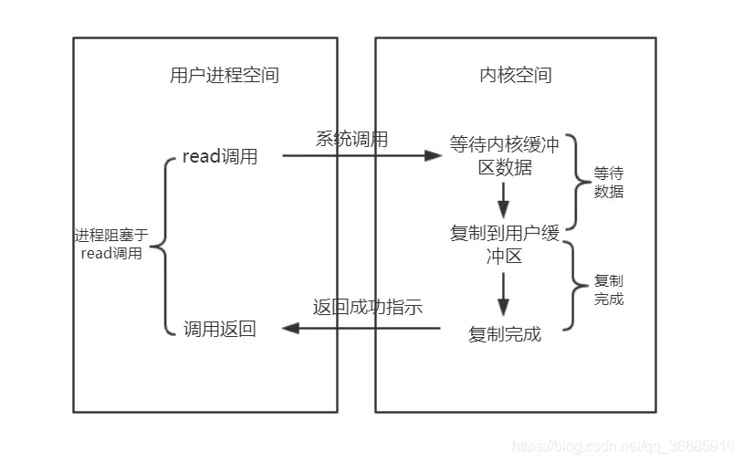
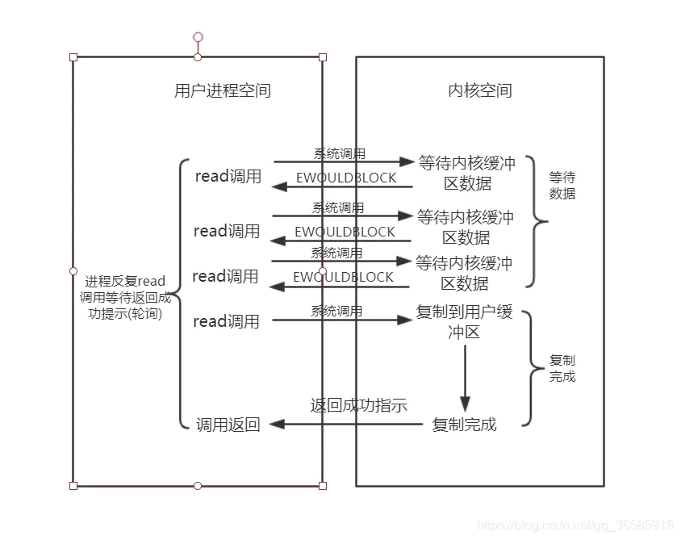
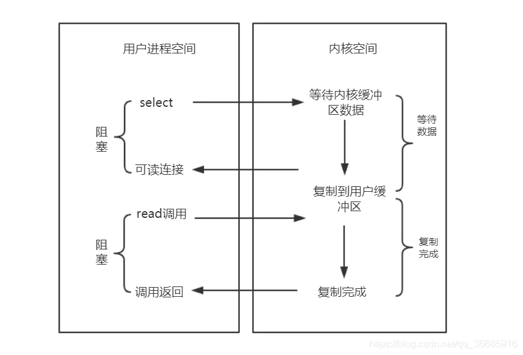
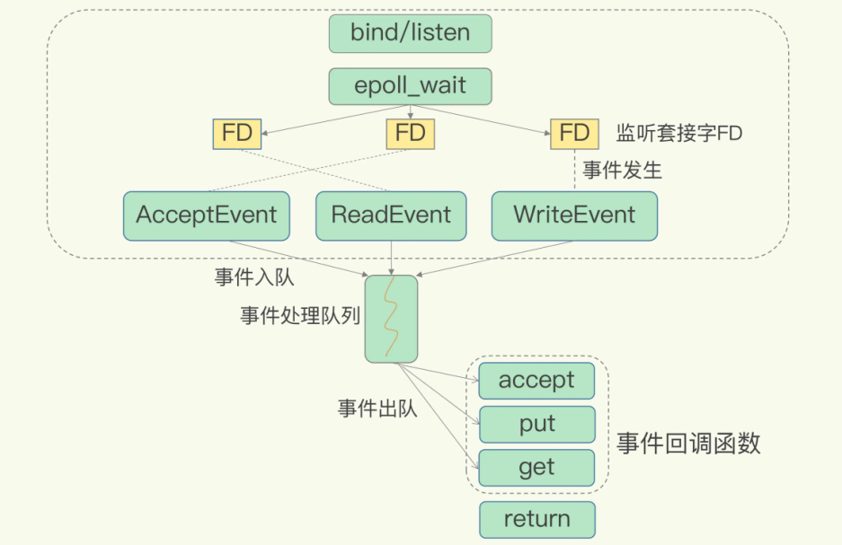
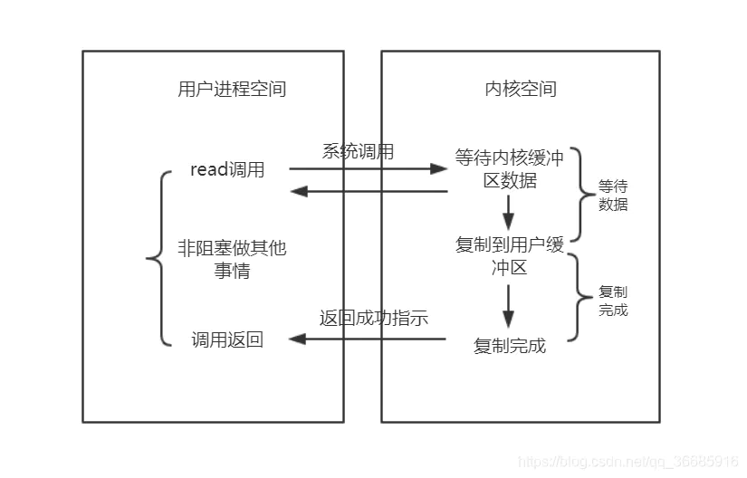

# Java中四种主要的I/O模型

## 同步阻塞I/O（BIO）

在linux中的Java进程中，默认情况下所有的socket都是blocking IO。在阻塞式 I/O 模型中，应用程序在从IO系统调用开始，一直到到系统调用返回，这段时间是阻塞的。返回成功后，应用进程开始处理用户空间的缓存数据。

## 同步非阻塞I/O（NIO）

在Linux系统下，可以通过设置Socket使其变为Non-blocking。NIO 模型中应用程序在一旦开始IO系统调用，会出现以下两种情况：

1.在内核缓冲区没有数据的情况下，系统调用会立即返回，返回一个调用失败的信息。

2.在内核缓冲区有数据的情况下，是阻塞的，直到数据从内核缓冲复制到用户进程缓冲。复制完成后，系统调用返回成功，应用进程开始处理用户空间的缓存数据。

## I/O多路复用模型（NIO）

**<u>Java中的NIO就是采用此种I/O模型，Redis中也是采用此种I/O模型。</u>**

IO多路复用模型，就是通过一种新的系统调用，一个进程可以监视多个文件描述符，一旦某个描述符就绪（一般是内核缓冲区可读/可写），内核能够通知程序进行相应的IO系统调用。

目前支持IO多路复用的系统调用，有 Select，Epoll等等。Select系统调用，是目前几乎在所有的操作系统上都有支持，具有良好跨平台特性。Epoll是在Linux 2.6内核中提出的，是Select系统调用的Linux增强版本。

IO多路复用模型的基本原理就是Select/Epoll系统调用，单个线程不断的轮询Select/Epoll系统调用所负责的成百上千的Socket连接，当某个或者某些Socket网络连接有数据到达了，就返回这些可以读写的连接。因此，好处也就显而易见了——通过一次Select/Epoll系统调用，就查询到到可以读写的一个甚至是成百上千的网络连接。

在这种模式中，首先不是进行Read系统调动，而是进行Select/Epoll系统调用。当然，这里有一个前提，需要将目标网络连接，提前注册到Select/Epoll的可查询Socket列表中。然后，才可以开启整个的IO多路复用模型的读流程。

### Redis中的I/O多路复用模型图示

### Java 中的I/O多路复用模型

Selector会不断轮询各个Channel，直到某一个Channel已经准备好。

## 异步I/O模型（AIO）

1.用户线程通过系统调用，告知内核启动某个IO操作，用户线程返回。（用户线程不阻塞）

2.内核在整个IO操作（包括数据准备、数据复制）完成后，通知用户程序，用户执行后续的业务操作。

