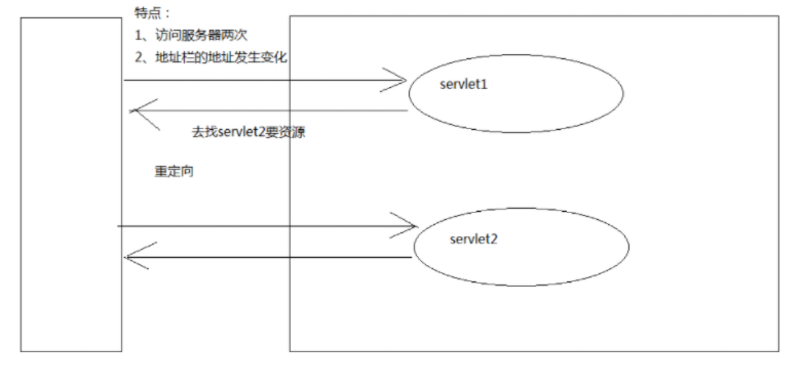
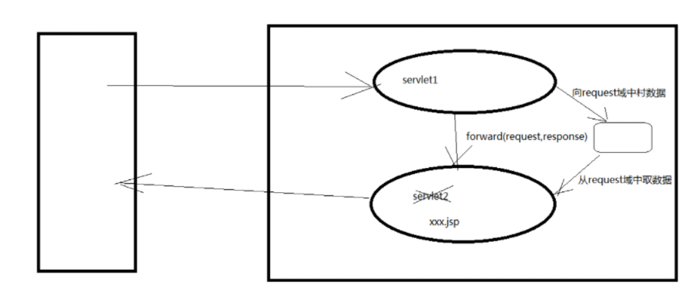

# 转发与重定向

## 转发与重定向的细节对比

| 转发               | 重定向           |
| ---------------- | ------------- |
| URL地址栏的值不会变      | URL地址栏的值会改变   |
| 会携带Request信息     | 不会携带Request信息 |
| 只会发生一次访问         | 会发生两次访问       |
| 一般仅用于内部资源        | 可用于内部资源+外部资源  |
| 性能更好（因为是服务器内部行为） | 性能差于转发        |

## 重定向示意图



## 转发示意图



## 实际代码运用

### SpringMVC转发与重定向

```java
//转发
return "forward:/WEB-INF/jsp/test.jsp";
//重定向
return "redirect:/index.jsp";
```

### Servelet转发与重定向

```java
//转发
request.getRequestDispatcher("/").forward(request,response);
//重定向
response.sendRedirect("/web/servlet2");
```
